# ВКД · Оценка рисков — техническая документация

**КосмоХакатон 2026 · кейс «Прогнозирование внешних рисков и планирование ВКД на МКС»**

Сервис поддержки решений для аналитика группы планирования выходов в открытый космос. Он подбирает время выхода
космонавтов с Международной космической станции (МКС), при котором внешние опасности минимальны, и объясняет простыми
словами, почему выбран именно этот вариант и на каких данных основан вывод.

| | |
|---|---|
| Репозиторий | <https://github.com/Serfetto/nice-reshenie> |
| Развёрнутый сервис | `cosmohack.pylonpn.tech` |
| Версия алгоритма | 0.0.1 |
| Время в интерфейсе | московское (МСК = UTC+3); в API, JSON и CSV — UTC |
| Язык и стек | Python 3.12, FastAPI, PostgreSQL, обычный HTML/CSS/JS + Plotly, Docker Compose |


---

## Оглавление

1. [Коротко о решении](#1-коротко-о-решении)
2. [Ключевые возможности](#2-ключевые-возможности)
3. [Словарь: термины простыми словами](#3-словарь-термины-простыми-словами)
4. [Архитектура](#4-архитектура)
5. [Методы: как сервис оценивает опасность](#5-методы-как-сервис-оценивает-опасность)
6. [Руководство пользователя: экран за экраном](#6-руководство-пользователя-экран-за-экраном)
7. [Графики работы и проверка качества](#7-графики-работы-и-проверка-качества)
8. [API](#8-api)
9. [Установка и запуск](#9-установка-и-запуск)
10. [Структура репозитория](#10-структура-репозитория)
11. [Технологии и библиотеки](#11-технологии-и-библиотеки)
12. [Ограничения и развитие](#12-ограничения-и-развитие)
13. [Приложения](#13-приложения)

---

## 1. Коротко о решении

### 1.1. Какую задачу решаем

Выход в открытый космос (внекорабельная деятельность, **ВКД**) длится 6–7 часов. Всё это время космонавта защищает
только скафандр. Снаружи есть две опасности, и обе меняются со временем:

1. **Частицы от Солнца.** После вспышек Солнце выбрасывает поток протонов. Магнитное поле Земли прикрывает станцию, но
   неравномерно: у экватора защита сильная, ближе к полюсам — слабая, а во время магнитной бури граница защиты
   сдвигается к экватору. МКС облетает Землю за 90 минут и за один выход много раз проходит и защищённые, и открытые
   участки.
2. **Мусор и метеороиды.** Вокруг Земли летают тысячи спутников и обломков. Относительная скорость сближения достигает
   15 км/с: на такой скорости даже 1 грамм вещества несёт энергию около 100 кДж — как 25 граммов тротила. Мелкие
   частицы (метеороиды) поштучно не видны, но в дни метеорных потоков их становится больше.

Аналитику группы планирования нужно ответить на вопрос: **когда начать выход, чтобы за всё время работы встретить как
можно меньше опасностей — и насколько этому ответу можно доверять.** Нужные данные разбросаны по десятку сайтов NOAA,
NASA и Space-Track, в разных форматах и с разным временем публикации. Наш сервис собирает их сам, сопоставляет с
траекторией МКС минута за минутой и выдаёт готовый ответ: «лучше всего начать в 11:45 МСК, потому что…».

### 1.2. Что делает сервис

- **Рассчитывает положение МКС** на весь период поиска с шагом 30 секунд.
- **Оценивает два независимых механизма опасности** — частицы от Солнца и мусор с метеороидами — по каждой минуте.
- **Делит факторы на стоп-факторы и нежелательные условия**, как это принято на практике: при стоп-факторе выход не
  планируют, нежелательные условия понижают вариант в сравнении.
- **Перебирает все варианты начала** выхода одинаковой длительности (каждые 15 минут) и выбирает лучший по
  прозрачному правилу.
- **Объясняет ответ** простыми словами и даёт ссылку на каждое измерение вплоть до исходного скачанного файла.
- **Честно показывает надёжность** прогноза и подсказывает, когда пересчитать.
- **Следит за выбранным временем** и присылает оповещение, если обстановка изменилась (в консоль, в браузер и в Telegram).
- **Проверяет сам себя на прошлом:** можно «вернуться» в любой момент 2024 года, получить ответ только по тем данным,
  которые тогда были известны, и сравнить его с тем, что случилось на самом деле.

### 1.3. Чего сервис не делает

- Не выдаёт разрешение на выход и не заявляет «безопасно». Решение остаётся за уполномоченными специалистами.
- Не рассчитывает дозу облучения космонавта и вероятность попадания обломка в человека. Сервис оценивает **внешние
  условия** и то, как они пересекаются с окном работ.
- Не использует машинное обучение и языковые модели. Все правила и модели явные, каждый порог записан в настройках и
  обоснован (раздел [5.8](#58-на-чём-основаны-пороги)).

### 1.4. Сервис за одну минуту

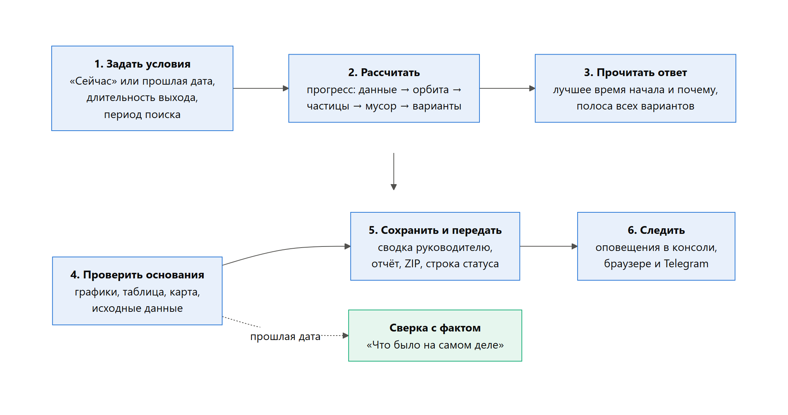

1. Аналитик выбирает момент («Сейчас» или прошлую дату), длительность выхода и, если нужно, плановое время начала.
2. Нажимает «Рассчитать окна». Расчёт занимает около 3 секунд, прогресс виден по этапам.
3. Крупно видит ответ: лучшее время начала и по одной строке на каждую опасность.
4. Если нужно, раскрывает подробности: графики, таблицу всех вариантов, карту пути станции, исходные данные.
5. Сохраняет результат: краткую сводку для руководителя, полный отчёт или ZIP-архив со всеми данными.
6. Ставит выбранное время на отслеживание и получает оповещения, если обстановка ухудшится.

### 1.5. Три режима работы

| Режим | Как включить | Какие данные видит расчёт | Зачем |
|---|---|---|---|
| **Сейчас** | кнопка «Сейчас» | всё, что собрано на текущий момент, с автообновлением | планирование реального выхода |
| **Прогноз из прошлого** (replay) | «Выбрать дату» | только данные, **опубликованные до выбранного момента** | проверить, что сервис посоветовал бы тогда, и сравнить с фактом |
| **Разбор по полному архиву** (review) | «Выбрать дату» + галочка «Полный архив» | весь архив, включая поздние уточнения | разобрать, какой была обстановка на самом деле |

Код расчёта для всех режимов один и тот же. Режимы отличаются только тем, какой срез данных получает ядро.

---

## 2. Ключевые возможности

| # | Возможность | Что это даёт пользователю | Где в консоли |
|---|---|---|---|
| 1 | **Рекомендация одним предложением** | «Лучше всего начать в 19:45 МСК» или честное «хороших вариантов нет, наименее неблагоприятный — …» | «Расчёт», верх результата |
| 2 | **Два механизма опасности** | частицы от Солнца и мусор с метеороидами оцениваются отдельно и не смешиваются в одно число | строки под ответом |
| 3 | **Полоса всех вариантов начала** | каждый квадратик — вариант начала; цвет сразу показывает, где хорошо, где хуже, где стоп-фактор | «Все варианты начала» |
| 4 | **Сравнение с планом** | если задано плановое начало, сервис скажет, чем план хуже лучшего варианта | ответ, строка «Ваш план» |
| 5 | **Запас на задержку** | через сколько минут после планового конца начнётся первый стоп-фактор, если работа затянется | ответ и таблица вариантов |
| 6 | **«Почему так? Откуда данные»** | каждое утверждение раскрывается до измерения, времени публикации и исходного файла | кнопка под ответом, клик по интервалу |
| 7 | **Надёжность и «когда пересчитать»** | высокая / средняя / низкая с причиной и ближайшим выпуском прогноза, который уточнит ответ | под ответом |
| 8 | **Прогноз из прошлого** | расчёт «как будто сейчас 08.06.2024 06:00» без подглядывания в будущее | «Выбрать дату» |
| 9 | **Сверка с фактом** | «Что было на самом деле»: угаданные, пропущенные минуты и ложные тревоги | вкладка в «Подробностях» |
| 10 | **Разбор по полному архиву** | реконструкция реальной обстановки задним числом | галочка «Полный архив» |
| 11 | **Проверка сбоя источника** | можно отключить или «заморозить» любой источник только для своего расчёта и увидеть, что сервис скажет «нет данных», а не «всё хорошо» | «Расширенные настройки» |
| 12 | **Выбор модели прогноза** | наша модель или две простые для сравнения: «как сейчас, так и будет» и «только предупреждения SWPC» | «Расширенные настройки» |
| 13 | **Изменение длительности = новый план** | более короткий выход сравнивается только с вариантами той же длительности и помечается как изменение плана, а не «стало лучше» | «Таблица вариантов» → «Пересчитать план» |
| 14 | **Слежение и оповещения** | пересчёт выбранного времени при каждом поступлении данных; сообщение, когда появился стоп-фактор, стало хуже, пропали данные или стало лучше | кнопка «Следить…», раздел «Оповещения» |
| 15 | **Проигрывание прошлого дня** | для прошлой даты день прокручивается ускоренно (полчаса за ≈5 с), и видно, когда пришло бы предупреждение | «Показать предупреждения, как в тот день» |
| 16 | **Три канала доставки** | лента и всплывающие сообщения в консоли, системное уведомление браузера, Telegram-бот | раздел «Оповещения» |
| 17 | **Сводка для руководителя** | одна страница для печати: рекомендованное окно, причины, лучшие окна, шкала | кнопка «Сводка для руководителя» |
| 18 | **Полный отчёт и ZIP** | отчёт со всеми окнами, интервалами, сближениями, доказательствами; архив с JSON и CSV | вкладка «Сохранить» |
| 19 | **Строка статуса для экипажа** | одна строка вида `ВКД 19:45–23:45 МСК · РАД ● прием · MMOD ● прием · данные 11 мин` | вкладка «Сохранить» |
| 20 | **Панель источников** | что скачивается, откуда, насколько свежее; «Обновить», «Обновить все», «Заморозить», «Скачать CSV» | раздел «Источники» |
| 21 | **Сохранённые расчёты** | каждый расчёт сохраняется сам; поиск, фильтры, название, повторное открытие, удаление | раздел «Сохранённое» |
| 22 | **Воспроизводимость** | в каждом расчёте — запрос, версия алгоритма, хэши файлов настроек и список использованных исходных файлов | отчёт, ZIP, JSON |
| 23 | **Самовосстановление данных** | при каждом старте сервис сам догружает недостающие дни архива и пропуск за время простоя | индикатор «архив: загружено N из M дней» |
| 24 | **Карта пути станции** | трасса МКС в окне выхода, раскрашенная по обстановке, и места сближений | вкладка «Где летит станция» |
| 25 | **Готовые сценарии 2024 года** | пять реальных событий запускаются одним кликом | главный экран, «Быстрый старт» |
| 26 | **Работа без внешнего интернета в браузере** | графики и карта вложены в сервис, браузеру не нужны внешние CDN | — |
| 27 | **Светлая и тёмная тема, встроенная справка** | удобство для работы днём и в затемнённом зале | кнопки в шапке |

---

## 3. Словарь: термины простыми словами

| Термин | Что это значит |
|---|---|
| **ВКД** | внекорабельная деятельность, выход в открытый космос |
| **МКС** | Международная космическая станция; летит на высоте ≈420 км, оборот вокруг Земли — ≈90 минут |
| **Окно (вариант начала)** | интервал заданной длительности, например 09:00–15:30. Сервис сравнивает окна одинаковой длины |
| **Стоп-фактор** (critical) | условие, при котором выход не планируют, а идущий прерывают |
| **Нежелательно** (undesirable) | не критично, но хуже; такие минуты понижают вариант в сравнении |
| **Нет данных** (no_data) | оценить нельзя. Это никогда не считается хорошей новостью |
| **GOES** | американские метеоспутники на геостационарной орбите (36 000 км); измеряют поток протонов от Солнца каждые 5 минут |
| **pfu** | единица потока частиц: частиц на см² в секунду на стерадиан |
| **Шкала S (S1–S5)** | шкала NOAA для солнечных радиационных бурь. S1 — от 10 pfu, S3 — от 1000 pfu (NOAA рекомендует избегать ВКД) |
| **SWPC** | центр прогнозов космической погоды NOAA; публикует предупреждения, алерты и прогнозы |
| **Kp** | индекс магнитной бури от 0 до 9. Чем больше, тем слабее защита магнитного поля |
| **ЮАА** | Южно-Атлантическая аномалия: зона над Южной Атлантикой, где магнитное поле слабее и радиация выше. МКС пролетает её ≈8 раз в сутки, всего ≈75 минут |
| **Жёсткость обрезания** | порог «пропускной способности» магнитного поля в данной точке: частицы с меньшей энергией до станции не доходят |
| **J_iss** | наша оценка потока частиц, которые реально долетают до МКС в данной точке орбиты. Это показатель обстановки, а не доза |
| **TLE** | «двустрочные элементы» — стандартная запись орбиты спутника |
| **SGP4** | стандартная модель, по которой из TLE вычисляют положение спутника в любой момент |
| **Space-Track** | каталог орбит всех отслеживаемых объектов (Минобороны США, 18th SDS) |
| **MMOD** | micrometeoroids and orbital debris — микрометеороиды и орбитальный мусор |
| **Зона контроля МКС** | «коробка» вокруг станции ±2 км по высоте и ±25 км вдоль и поперёк орбиты (NASA «pizza box» 4 × 50 × 50 км). Пролёт объекта через неё — стоп-фактор |
| **TCA** | момент наибольшего сближения объекта со станцией |
| **Метеорный поток** | период, когда Земля проходит через шлейф частиц кометы и мелких частиц становится больше обычного |
| **Радиант** | точка неба, откуда летят частицы метеорного потока. Если она закрыта Землёй, станция от потока прикрыта |
| **Момент T (отсечка)** | момент, «на который» делается расчёт. В прогнозе из прошлого ядро видит только данные, опубликованные до T |
| **Replay / прогноз из прошлого** | расчёт на прошлую дату без знания будущего — для честной проверки |
| **Реконструкция** | архивные данные, созданные позже события (например, окончательный Kp). Помечаются в интерфейсе |
| **POD / FAR** | доля найденных опасных минут / доля ложных тревог — стандартные метрики проверки прогнозов |
| **МСК / UTC** | московское время / всемирное время. МСК = UTC + 3 ч |

---

## 4. Архитектура

### 4.1. Общая схема

<p align="center">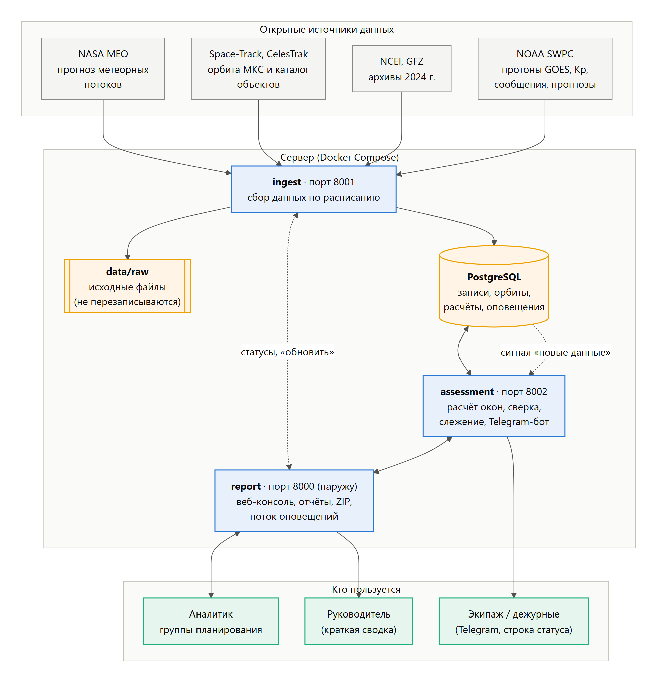</p>

Сервис состоит из трёх приложений и базы данных, которые запускаются одной командой `docker compose up`:

| Сервис | Порт | Что делает | Наружу |
|---|---|---|---|
| **ingest** | 8001 | собирает данные по расписанию, хранит исходные файлы, ведёт статусы источников, отдаёт CSV | нет (только 127.0.0.1) |
| **assessment** | 8002 | расчёт окон, объяснения и доказательства, сверка с фактом, слежение и оповещения, Telegram-бот | нет (только 127.0.0.1) |
| **report** | 8000 | веб-консоль, краткая сводка, полный отчёт, ZIP-экспорт, живая лента оповещений (SSE); проксирует запросы к двум другим сервисам | **да** |
| **db** | — | PostgreSQL 16: записи, орбиты, расчёты, слежения, оповещения | нет |

Как они связаны:

- `ingest` и `assessment` не вызывают друг друга за данными. Общий слой — база. Когда приходят новые данные, `ingest`
  отправляет сигнал через механизм PostgreSQL `LISTEN/NOTIFY`, без отдельного брокера сообщений.
- Если сборщик данных упадёт, расчёты продолжат работать: `assessment` увидит, что данные устарели, пометит это в
  ответе и пришлёт оповещение о потере данных по отслеживаемым выходам.
- `report` ничего не считает сам. Он отвечает за всё, что видит человек: страницы, отчёты, доставку оповещений.
- Наружу открыт только порт 8000. Сервисы перезапускаются автоматически (`restart: unless-stopped`), у каждого есть
  проверка работоспособности (`/health`).

### 4.2. Принципы, на которых построен сервис

1. **Исходные данные неизменяемы.** Каждый скачанный файл сохраняется как есть и никогда не перезаписывается. Любое число
   в ответе можно проследить до этого файла.
2. **Ядро расчёта не знает текущего времени.** Оно получает только срез «что было известно на момент T», поэтому
   подсмотреть будущее в прогнозе из прошлого невозможно технически.
3. **У каждого значения есть происхождение:** измерение, внешний прогноз или наш расчёт; источник; время публикации;
   ссылка на исходный файл.
4. **«Нет данных» — полноценное состояние.** Оно никогда не превращается в «норму».
5. **Стоп-факторы ничем не компенсируются.** Механизмы не складываются в одно число: хорошие данные по одному механизму
   не перекрывают стоп-фактор или отсутствие данных по другому.
6. **Расчёт — неизменяемый объект.** Запрос, отсечка, версии, использованные файлы и результат сохраняются целиком.
7. **Автономность.** В пути расчёта нет облачных сервисов. Внешняя сеть нужна только сборщику данных.

### 4.3. Сбор данных (ingest)

<p align="center">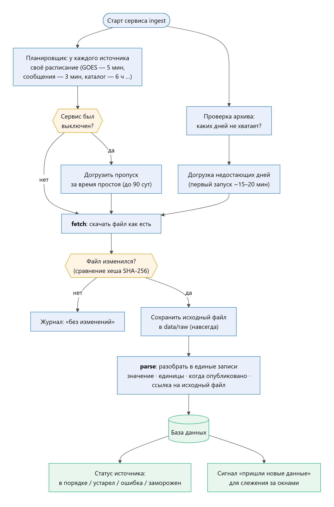</p>

Каждый источник подключается отдельным модулем-адаптером с одинаковым устройством:

- `fetch` — скачать файл как есть и записать в журнал;
- `parse` — разобрать его в единые записи: значение, единицы, к какому интервалу относится, **когда опубликовано**,
  ссылка на исходный файл и строку в нём.

Файл сохраняется в `data/raw/<источник>/<год>/<месяц>/<день>/…` только если он изменился (сравнивается хэш SHA-256).
У сообщений SWPC разбираются код, серийный номер, время выпуска и ссылки «продление к № …» / «отмена № …». При расчёте
цепочка «предупреждение → продление → отмена» связывается по серийным номерам и учитывается как одно событие со
сроком последнего продления, а не как несколько отдельных.

**Расписание** подобрано под ритм публикации источника (из `config/sources.yaml`):

| Источник | Опрос | Данные считаются устаревшими через |
|---|---|---|
| Сообщения SWPC | каждые 3 мин | 1 ч без успешной проверки ленты |
| Протоны GOES | каждые 5 мин | 30 мин |
| Kp наблюдённый | каждые 15 мин | 4 ч |
| Прогноз Kp | каждые 30 мин | 6 ч |
| 3-дневный прогноз SWPC, RSGA | каждый час + после плановых выпусков | 13 ч / 26 ч |
| Орбита МКС (Space-Track) | каждый час | 2 сут |
| Орбита МКС (CelesTrak, резерв) | раз в 2 ч | 2 сут |
| Каталог объектов (Space-Track) | раз в 6 ч | 1 сут |
| Прогноз метеорных потоков NASA | раз в сутки | 400 сут |

**Самовосстановление.** При каждом старте `ingest`:

- ищет дни без данных в архивных периодах и догружает их (пустая база — всё, это ≈15–20 минут; после перезапуска —
  только недостающее). Дни, которых нет у поставщика (например, пропуск 3-дневных прогнозов в архиве NCEI
  15.05–16.06.2024), запоминаются и перепроверяются не чаще раза в неделю;
- догружает пропуск живых данных за время простоя (до 90 суток): протоны — продуктами SWPC за 1/3/7 суток или архивом
  NCEI, Kp — из GFZ, сообщения — месячными архивами FTP, орбита и каталог — историей Space-Track;
- первый опрос каждого источника назначает по давности последней успешной загрузки: давно — сразу, свежие — по
  расписанию.

Архивные периоды: проверочный период 27.04–02.07.2024 и отложенные события для независимой проверки (08–24.02,
22–27.03, 08–13.10.2024).

**Статусы источника:** «в порядке», «данные устарели», «ошибка загрузки», «заморожен». Заморозка из консоли общая для
всех пользователей и снимается сама через 2 часа. Проверить сбой только в своём расчёте можно без заморозки — через
«Расширенные настройки».

### 4.4. Источники данных

| Источник (имя в системе) | Что измеряет | Где | Роль в расчёте |
|---|---|---|---|
| `goes_protons` — NOAA SWPC, архив NCEI GOES-18 SGPS L2 | интегральный поток протонов ≥10, 30, 50, 100, 500 МэВ, pfu, каждые 5 мин | геостационар | главное измерение для частиц от Солнца |
| `swpc_alerts` — SWPC `alerts.json`, архив FTP | алерты, предупреждения, сводки (протоны, бури, вспышки) | — | внешний прогноз, факт начала и конца событий |
| `kp_observed` — SWPC, архив GFZ Potsdam | индекс Kp по 3-часовым интервалам | планета | ослабление магнитной защиты |
| `kp_forecast` — SWPC | прогноз Kp на сутки | планета | Kp после момента T |
| `swpc_3day` — SWPC, архив NCEI | прогноз Kp и вероятность события S1 по суткам | планета | прогноз за горизонтом 6 ч |
| `swpc_rsga` — SWPC, архив NCEI | вероятность протонного события и вспышек на 3 суток | — | прогноз за горизонтом 6 ч (закрывает пропуски 3-дневного) |
| `iss_spacetrack` — Space-Track `gp`, `gp_history` | орбита МКС (TLE) с датой публикации | — | траектория для всех механизмов |
| `iss_celestrak` — CelesTrak | орбита МКС (TLE) | — | резерв, если Space-Track недоступен |
| `catalog_spacetrack` — Space-Track `gp`, `gp_history` | орбиты всех объектов, пересекающих высоты МКС (перигей < 460 км, апогей > 380 км) | — | поиск опасных сближений |
| `meteor_forecast` — NASA Meteoroid Environment Office | годовой почасовой прогноз метеорных потоков для низкой орбиты | низкая орбита | статистическая часть «мусора и метеороидов» |

**Почему именно эти.** GOES — единственный непрерывный ряд потока протонов по энергиям. Сообщения SWPC — официальный
факт начала и конца событий и готовые предупреждения. Kp нужен только для геометрии защиты и не считается отдельным
риском, чтобы не учесть одну бурю дважды. Каталог Space-Track работает одинаково и «сейчас», и для 2024 года (история с
датой публикации). Прогноз NASA MEO — единственный открытый датированный прогноз для мелких частиц.

**Что сознательно не используем:**

| Кандидат | Почему |
|---|---|
| Шкала R (радионарушения) | другое явление — КВ-радиосвязь, не условие ВКД |
| Освещённость (свет/тень) | условие работы, а не опасность (рассчитывается и отдаётся в данных) |
| DONKI GST, Kp с других сайтов | повтор того же измерения, а не независимое подтверждение |
| CelesTrak SOCRATES | нет архива для 2024 года; порог 5 км уже зоны контроля МКС вдоль орбиты. Заменён собственным отбором |
| NASA OEM | пригоден для истории орбиты, но Space-Track закрывает и историю, и текущую орбиту одной цепочкой |
| Электроны > 2 МэВ | связь потока на геостационаре с условиями ВКД требует модели внешнего радиационного пояса — развитие |
| Солнечный ветер ACE/DSCOVR, вспышки DONKI | дают заблаговременность 30–90 мин — развитие |

### 4.5. Хранилище

| Таблица | Что хранит |
|---|---|
| `raw_files` | журнал загрузок: источник, адрес, время, хэш, размер, результат разбора |
| `records` | числовые ряды: протоны, Kp, вероятности, метеорные потоки |
| `messages` | сообщения SWPC: код, серийный номер, время выпуска, срок действия, ссылки на продления и отмены |
| `elements` | орбитальные элементы МКС и объектов каталога с датой публикации |
| `source_status` | состояние каждого источника, последняя ошибка, заморозка |
| `archive_days` | какие дни архива загружены, каких нет у поставщика |
| `runs` | сохранённые расчёты: запрос, отсечка, версия, результат (JSON), название |
| `watches` | отслеживаемые выходы |
| `alerts` | оповещения: важность, текст, время, доставка, «принято» |
| `tg_chats` | подключённые чаты Telegram |

Локально без Docker используется SQLite (`data/app.db`), на сервере — PostgreSQL. Любая таблица выгружается в CSV.

### 4.6. Расчёт (assessment)

<p align="center">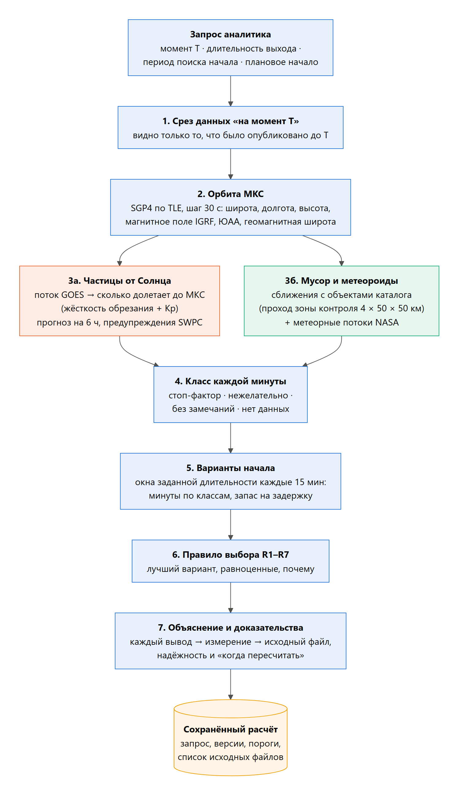</p>

`POST /runs` создаёт задание и сразу возвращает его номер. Дальше расчёт идёт в фоне по этапам, которые видны в
консоли как полоса прогресса: «собираю данные» → «считаю орбиту» → «частицы от Солнца» → «космический мусор» →
«сравниваю варианты» → «готово». Расчёт на сутки поиска (97 вариантов, ≈2000 объектов каталога) занимает около
**3 секунд** (замер на машине разработчика).

Результат сохраняется целиком и больше не меняется. Повторный расчёт создаёт новый. В результате есть всё, чтобы
повторить вывод: запрос, отсечка, версия алгоритма, действующие пороги и хэши файлов настроек (`result.config`),
список использованных исходных файлов (`result.manifest`), доказательства со ссылками на файлы.

### 4.7. Честное время: срез «на момент T»

<p align="center">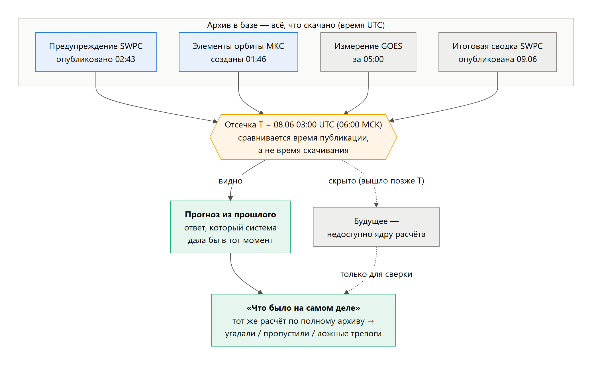</p>

Главная трудность исторического режима — не подсмотреть будущее. Весь архив 2024 года мы скачали в 2026-м, поэтому
время скачивания бесполезно. Сервис сравнивает с моментом T **время публикации из самого документа**:

| Данные | Какое время считается временем публикации |
|---|---|
| Алерты и предупреждения SWPC | `Issue Time` в тексте сообщения |
| 3-дневный прогноз, RSGA | строка `:Issued:` в файле |
| Орбиты (Space-Track) | `CREATION_DATE` — когда элементы созданы |
| Прогноз метеорных потоков NASA | дата выпуска документа (для 2024 г. — 02.11.2023) |
| Протоны GOES, Kp (живые) | конец интервала измерения |
| Архив GOES L2, окончательный Kp GFZ | восстановлено как конец интервала, помечено «реконструкция» |

Для орбит: среди наборов элементов, опубликованных до T, берётся набор с самой поздней эпохой (порядок публикации не
совпадает с порядком эпох: 10.05.2024 у МКС было 7 наборов, два с одинаковой эпохой).

В интерфейсе во вкладке «Данные и источники» видно, сколько записей использовано и сколько **отброшено как вышедшие
позже T**. Это прямое доказательство того, что будущее в расчёт не попало.

### 4.8. Слежение и оповещения

<p align="center">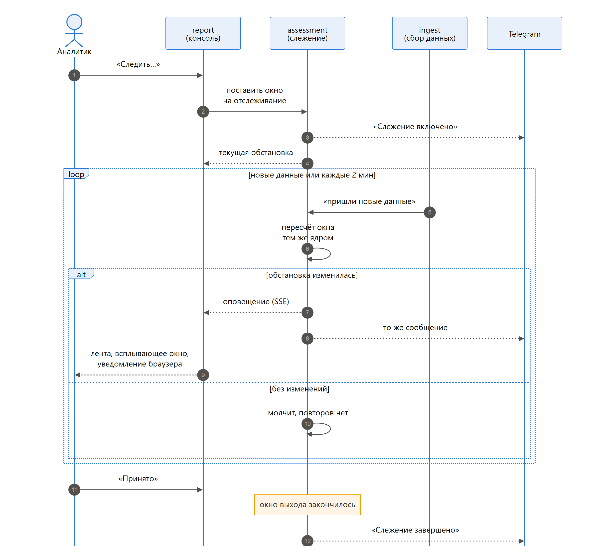</p>

- **В режиме «Сейчас»** окно пересчитывается тем же ядром по сигналу о новых данных от `ingest` и раз в 2 минуты.
- **Для прошлой даты** запускаются ускоренные «часы»: шаг 30 минут каждые ≈5 секунд, и на каждом шаге видны только
  данные, опубликованные к этому моменту «часов». Так можно увидеть, когда именно пришло бы предупреждение.
- Сообщение создаётся **только при изменении** состояния окна. Повторов по тому же состоянию нет.

| Вид сообщения | Когда приходит | Важность |
|---|---|---|
| Слежение включено | сразу, с текущей обстановкой | инфо |
| Стоп-фактор в окне | появился критический интервал; указано, через сколько минут он начнётся, и сравнение со временем возвращения в шлюз | стоп-фактор |
| Стало хуже | класс по механизму ухудшился | предупреждение |
| Пропали данные | источник по механизму устарел или недоступен | предупреждение |
| Стало лучше | класс по механизму улучшился | инфо |
| Слежение завершено | окно закончилось | инфо |

**Каналы доставки:** лента и всплывающие сообщения в консоли в реальном времени (SSE), системное уведомление браузера,
Telegram. Получатель открывает бота и нажимает Start — бот отвечает «✅ Оповещения подключены». Команды доступны
кнопками: «📋 Что отслеживается» (`/status`), «🔔 Проверить связь» (`/ping`), «🔕 Отключить оповещения» (`/stop`),
«❓ Помощь» (`/help`).

### 4.9. Веб-консоль (report)

Обычный HTML, CSS и JavaScript без сборки и фреймворков. Четыре раздела с адресами `#calc`, `#alerts`, `#sources`,
`#saved`. Графики и карта нарисованы Plotly.js, который вместе с картой мира вложен в сервис (`static/vendor`), —
браузеру не нужен доступ к внешним CDN. Сводка и отчёт собираются шаблонизатором Jinja2 на сервере. Оповещения
приходят в браузер потоком Server-Sent Events (`/api/alerts/stream`).

---

## 5. Методы: как сервис оценивает опасность

### 5.1. Орбита МКС

1. Берутся элементы орбиты МКС (TLE), опубликованные до момента T.
2. По модели SGP4 вычисляется положение станции с шагом **30 секунд** (за шаг МКС пролетает ≈230 км).
3. Координаты переводятся в земные: TEME → ITRF (поворот на звёздное время) → широта, долгота, высота (WGS84).
4. Для каждой точки по модели магнитного поля **IGRF-14** считаются модуль поля |B| (для ЮАА) и геомагнитная широта
   (для защиты от частиц).

### 5.2. Механизм 1 — частицы от Солнца

<p align="center">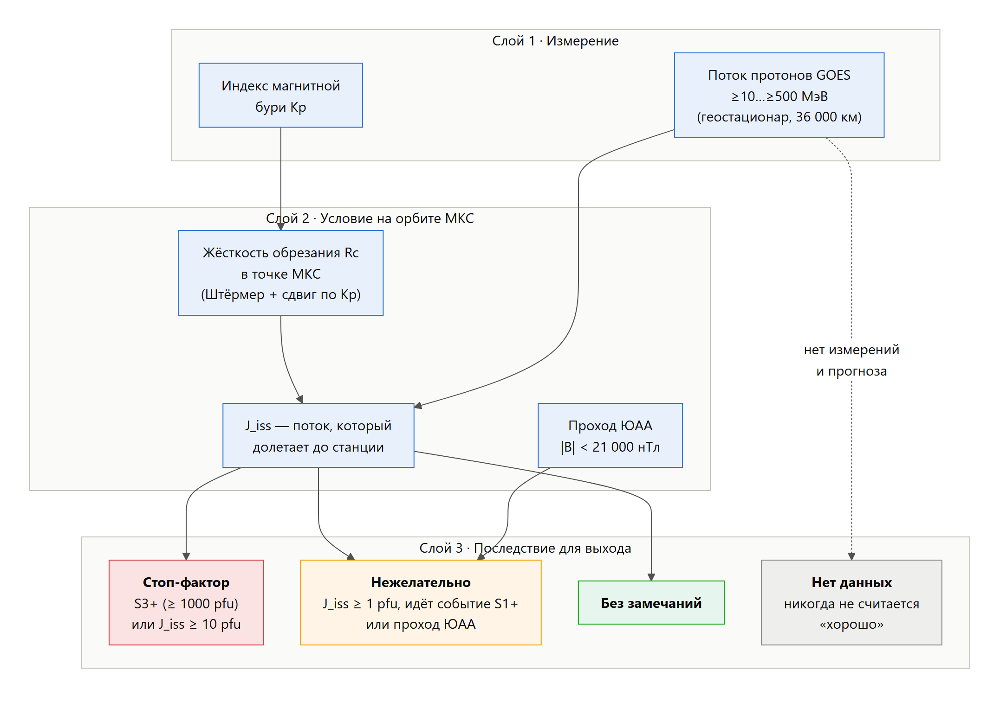</p>

Оценка идёт в три слоя: **что измерено → что это значит в точке, где сейчас МКС → что это значит для выхода.**

**Слой 1. Измерение.** Поток протонов GOES по пяти порогам энергии. Для архива 2024 года оперативных данных SWPC нет,
поэтому мы восстановили интегральный поток из 13 дифференциальных каналов научных файлов SGPS L2 (NCEI). Для события
08.06.2024 это воспроизводит оперативные данные SWPC: пик 996 pfu против 1030 pfu, превышение 10 pfu в 02:55 и
1 pfu ≥ 100 МэВ в 02:25 UTC — минута в минуту.

**Слой 2. Условие на орбите.** Магнитное поле пропускает к станции только частицы достаточно высокой энергии. Порог
считается по приближению Штёрмера:

```
Rc = 14.9 · cos⁴(λ_eff) / r²  ГВ,     λ_eff = |λm| + 1° · Kp
```

где λm — геомагнитная широта станции, r — расстояние от центра Земли в радиусах Земли. Магнитная буря (высокий Kp)
сдвигает границу защиты к экватору, поэтому Kp — не отдельный риск, а поправка к порогу. Из Rc получается энергия
обрезания, и по спектру GOES (интерполяция в логарифмах между порогами) оценивается **J_iss** — поток, который реально
долетает до станции.

**Слой 3. Последствие для выхода.**

| Условие | Класс | Основание |
|---|---|---|
| поток ≥ 10 МэВ на геостационаре ≥ 1000 pfu (S3 и выше) | стоп-фактор | шкала NOAA: при S3 рекомендовано избегать ВКД |
| J_iss ≥ 10 pfu | стоп-фактор | порог S1, применённый к потоку в точке МКС (допущение) |
| J_iss ≥ 1 pfu | нежелательно | частичное проникновение (уровень алерта SWPC ≥ 100 МэВ) |
| событие S1+ идёт, но станцию прикрывает поле | нежелательно | событие идёт |
| проход ЮАА (\|B\| < 21 000 нТл) | нежелательно | ожидаемый фон; минимизируется по принципу ALARA |
| иначе | без замечаний | |
| нет ни измерения, ни прогноза | нет данных | никогда не превращается в «без замечаний» |

**Что будет после момента T.** Будущий поток берётся по приоритету:

<p align="center">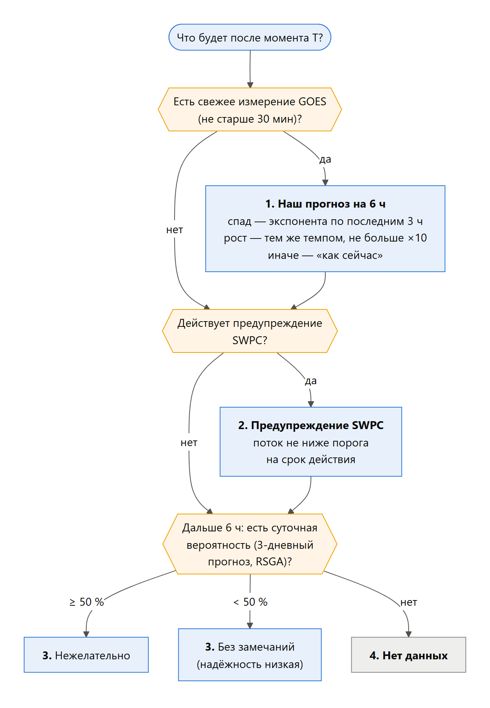</p>

1. **Наш прогноз на 6 часов** от последнего свежего измерения (форма спектра сохраняется):
   - спад — экспонента, подогнанная по последним 3 часам, не быстрее 0,15 ln/ч; пока SWPC не объявил окончание
     события, поток не опускается ниже S1;
   - нарастание (поток растёт и за 3 часа, и за последний час) — рост с тем же темпом, но не больше чем в 10 раз;
   - иначе — «как сейчас».
2. **Предупреждения SWPC** (≥ 10 МэВ > 10 pfu, ≥ 100 МэВ > 1 pfu) с учётом продлений и отмен: поток не ниже порога на
   срок действия.
3. **Суточная вероятность** (3-дневный прогноз, RSGA): ≥ 50 % — нежелательно, иначе без замечаний с низкой
   надёжностью. Если событие уже идёт, за горизонтом прогноза — нежелательно.
4. Иначе — нет данных. Если измерения устарели (старше 30 минут на момент T), свой прогноз не строится.

**Kp после T:** наблюдение → прогноз SWPC → сохранение на 6 ч → консервативно Kp = 5.

Для сравнения в «Расширенных настройках» можно выбрать две простые модели: «как сейчас, так и будет» и «только
предупреждения SWPC». Их результаты на проверке — в разделе [7.4](#74-эксперимент-прогноз-из-прошлого-на-солнечных-событиях).

### 5.3. Механизм 2 — мусор и метеороиды

Постановщик задачи напомнил о скоростях: первая космическая — 7,9 км/с, и на такой скорости даже малая частица несёт
энергию снаряда. Поэтому механизм состоит из двух частей.

**Отслеживаемые объекты — сближения (стоп-фактор).**

<p align="center">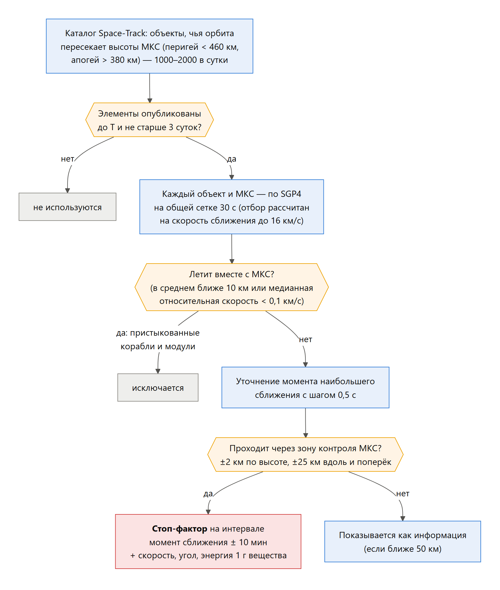</p>

- Из каталога Space-Track берутся все объекты, чья орбита пересекает высоты МКС: 1000–2000 объектов в сутки.
- Используются последние элементы, опубликованные до T, не старше 3 суток.
- Все объекты и МКС рассчитываются по SGP4 на одной сетке. Предварительный отбор рассчитан на относительную скорость до
  16 км/с (встречное сближение двух орбит на высоте МКС — до 15,3 км/с), поэтому при шаге 30 с пролёт не теряется.
  Вокруг минимумов расстояния момент уточняется с шагом 0,5 с (ошибка из-за шага — медиана 28 м).
- **Исключаются объекты, летящие вместе с МКС:** пристыкованные корабли и модули (у каждого свой TLE, который
  расходится с TLE станции на 6–15 км). Признак — в среднем ближе 10 км или медианная относительная скорость
  < 0,1 км/с. Без этого признака они давали ложные «сближения» каждый виток.
- **Проход через зону контроля МКС** (±2 км по высоте, ±25 км вдоль и поперёк орбиты) — **стоп-фактор** на интервале
  «момент наибольшего сближения ± 10 минут». Для каждого сближения показываются относительная скорость, тип пролёта
  (встречный ≥ 120°, поперечный, попутный < 60°) и энергия 1 г вещества: при 14,6 км/с это ≈107 кДж ≈ 25 г тротила.
  Поэтому размер объекта и вероятность попадания не взвешиваются.
- Каталог недоступен или старше суток — «нет данных».

**Неотслеживаемые частицы — метеорные потоки (статистика).** Частицы меньше ≈10 см в каталог не попадают. Для них
используется годовой прогноз NASA Meteoroid Environment Office: почасовое отношение потока метеоров к обычному фону для
энергии 6,7 Дж (частица ≈0,4 мм при 20 км/с; скафандр — тонкая оболочка, NASA рекомендует оценивать по наименьшей
частице, способной пробить элемент).

- Поток виден, только если его радиант не закрыт Землёй (с атмосферой до 100 км) в точке, где находится МКС.
- Отношение ≥ 25 % и радиант виден → «нежелательно» (не выше: это рост вероятности, а не событие). В 2024 году
  срабатывает в начале июня (Дневные Ариетиды и дзета-Персеиды, до +33 %).
- Обычный фон мусора и метеороидов одинаков для окон равной длительности и в сравнении не участвует.

### 5.4. Классы минут

Каждая минута периода получает по каждому механизму один из четырёх классов:

| Класс | Цвет в консоли | Смысл | Влияние на вариант |
|---|---|---|---|
| стоп-фактор | красный | выход не планируют | вариант «не рекомендуется» |
| нежелательно | оранжевый | хуже, но не критично | понижает в сравнении |
| без замечаний | зелёный | обычный фон | — |
| нет данных | серый | оценить нельзя | вариант «нужно проверить» |

К каждому интервалу прилагаются причина (например, «частицы от Солнца долетают до станции»), тип основания
(измерение, внешний прогноз, наш расчёт), надёжность с объяснением и ссылки на доказательства.

### 5.5. Варианты начала и правило выбора

Кандидаты — окна заданной длительности с шагом 15 минут по периоду поиска (по умолчанию — ближайшие сутки, можно до
72 часов), плюс плановое окно. Для каждого окна и механизма считаются минуты по классам, надёжность, для радиации —
суммарный поток за окно (pfu·мин), и **запас на задержку** — через сколько минут после конца начнётся первый
стоп-фактор.

<p align="center">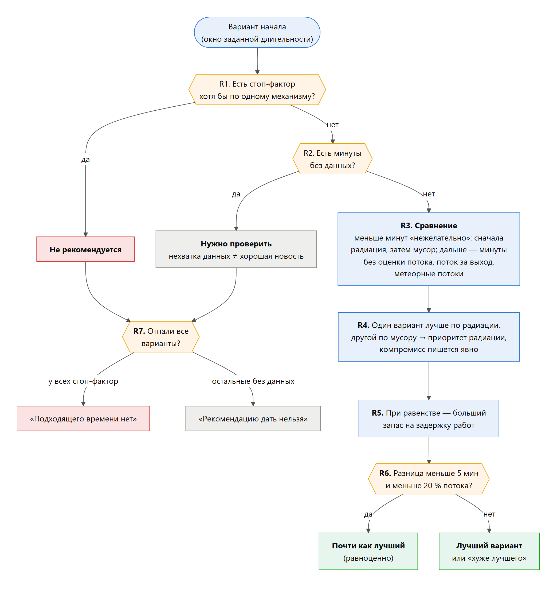</p>

| Правило | Содержание |
|---|---|
| **R1** | есть стоп-фактор в окне → «не рекомендуется» |
| **R2** | есть интервалы без данных → «нужно проверить» |
| **R3** | остальные: меньше минут нежелательных условий — сначала по радиации, затем по мусору; дальше — меньше минут без количественной оценки потока, меньше потока за окно, меньше минут метеорных потоков (статистика — последней) |
| **R4** | один вариант лучше по одному механизму, другой — по другому: решает приоритет (радиация важнее), компромисс выводится явно |
| **R5** | при равенстве — больший запас на задержку |
| **R6** | разница меньше 5 минут и меньше 20 % потока — «почти как лучший» (равноценно) |
| **R7** | нет окна без стоп-факторов → «подходящего времени нет»; остальные без данных → «рекомендацию дать нельзя» |

Если даже у лучшего варианта есть нежелательные условия кроме фоновых (ЮАА, метеорные потоки), консоль не выдаёт его за
хороший и пишет: **«Хороших вариантов нет. Наименее неблагоприятный — …»**.

Изменение длительности — это новый план. Более короткий выход сравнивается только с вариантами той же длительности,
и консоль показывает баннер «Изменён план», а не «стало лучше».

### 5.6. Надёжность прогноза и «когда пересчитать»

| Уровень | Когда |
|---|---|
| **высокая** | свежее измерение GOES (не старше 15 минут) |
| **средняя** | наш прогноз до 3 часов от измерения; действующее предупреждение SWPC; сближение не дальше 12 часов по элементам не старше 2 суток |
| **низкая** | наш прогноз на 3–6 часов; только суточная вероятность; событие идёт за горизонтом прогноза; сближение дальше 12 часов; метеорные потоки (статистика); Kp неизвестен и принят с запасом |
| **нет** | нет данных |

Надёжность окна — минимальная по механизмам. Граница 12 часов для сближений взята из собственной проверки (раздел
[7.5](#75-эксперимент-устойчивость-прогноза-сближений)). При низкой надёжности ответ помечается «предварительно», и сервис
подсказывает, когда пересчитать: ближайшие плановые выпуски прогнозов SWPC или момент, когда окно войдёт в горизонт
нашего прогноза.

### 5.7. Объяснения и доказательства

Объяснение собирается из фактов, а не пересказывает уровень угрозы. Пример из расчёта на 08.06.2024:

> W24 11:45–18:15 МСК: предпочтительно. Радиация: нежелательных 390 мин (идёт протонное событие, МКС под защитой
> магнитного поля — 390 мин); оценка потока выше порога обрезания за окно 1 pfu·мин; уверенность низкая. Мусор и
> метеороиды: нежелательных 242 мин (метеорный поток …). Запас на задержку: критических факторов нет в течение 60 мин
> после окончания.

Каждое доказательство содержит: тип (измерение / сообщение SWPC / внешний прогноз / наш расчёт / орбита / каталог), слой
(измерение, условие на орбите, прогноз), значения с единицами, время, время публикации, источник и ссылку на исходный
файл с номером строки или объекта (`/api/i/raw/{id}?locator=…`). Файлы Space-Track наружу отдаются только выдержкой по
одному объекту: условия Space-Track ограничивают передачу данных третьим лицам.

### 5.8. На чём основаны пороги

Все параметры лежат в `config/thresholds.yaml`, и каждый расчёт сохраняет их хэш.

| Параметр | Значение | Основание |
|---|---|---|
| S3 на геостационаре — стоп-фактор | ≥ 1000 pfu ≥ 10 МэВ | шкала NOAA S3: «избегать ВКД» |
| событие идёт — нежелательно | ≥ 10 pfu ≥ 10 МэВ | порог S1 шкалы NOAA |
| частичное проникновение — нежелательно | J_iss ≥ 1 pfu | уровень алерта SWPC ≥ 100 МэВ в точке МКС (допущение) |
| проникновение — стоп-фактор | J_iss ≥ 10 pfu | порог S1 в точке МКС (допущение) |
| ЮАА | \|B\| < 21 000 нТл | откалибровано на ≈8 проходов и ≈75 мин в сутки |
| сдвиг границы защиты бурей | 1° на единицу Kp | эмпирическая поправка к диполю (допущение) |
| Kp неизвестен | 5 | консервативное допущение |
| спад / рост в нашем прогнозе | ≤ 0,15 ln/ч; рост > 0,2 ln/ч за 3 ч и за 1 ч, не больше ×10 | подобраны на событиях мая–июня, проверены на отложенных событиях |
| суточная вероятность — нежелательно | ≥ 50 % | допущение |
| зона контроля МКС | ±2 × ±25 × ±25 км | NASA «pizza box» 4 × 50 × 50 км |
| критический интервал сближения | TCA ± 10 мин | запас на ошибку времени по TLE и на то, чтобы экипаж занял защищённое положение |
| летит вместе с МКС | медиана \|Δv\| < 0,1 км/с | пересечение орбит — км/с, пристыкованные — ≈0,01 км/с (проверено на 01.05–30.06.2024) |
| метеорный поток — нежелательно | ≥ 25 % фона при 6,7 Дж | допущение; энергия — наименьшая в прогнозе NASA |
| равноценность вариантов | 5 мин, 20 % потока | допущение |
| шаг перебора вариантов | 15 мин | компромисс между точностью и числом вариантов (97 на сутки) |

### 5.9. Какие подходы рассматривали и почему выбрали этот

| Вопрос | Рассмотрели | Выбрали | Почему |
|---|---|---|---|
| Модель риска | машинное обучение, одно интегральное «число риска» | явные правила по слоям и механизмам | постановщик и эксперты: сложность оправдана только доказанной пользой; правила проверяемы, каждый порог обоснован, механизмы не компенсируют друг друга |
| Сближения | готовый продукт CelesTrak SOCRATES | собственный отбор по каталогу Space-Track | у SOCRATES нет архива (невозможен честный replay 2024 г.), и порог 5 км по дальности уже зоны контроля МКС вдоль орбиты |
| Орбита в прошлом | эфемериды NASA OEM | история TLE Space-Track (`gp_history` с `CREATION_DATE`) | одна цепочка и для «сейчас», и для истории; дата публикации позволяет отсечку T |
| Протоны 2024 г. | «наивное» интегрирование дифференциальных каналов | интегрирование с учётом максимума двух апертур датчика | наивный способ давал примерно половину оперативного потока; наш совпал с SWPC по времени начала и пика |
| Будущий поток | «как сейчас», только предупреждения SWPC | свой прогноз на 6 ч + предупреждения SWPC + суточные вероятности | на независимой проверке находит больше опасных минут при той же доле ложных тревог (раздел 7.4) |
| Интерфейс | React + TypeScript | обычный HTML/CSS/JS + Plotly | нет сборки, меньше зависимостей, быстрее правки; всё вложено в сервис и работает без внешних CDN |
| Telegram | библиотека aiogram | прямой вызов Bot API через httpx | одна зависимость меньше, достаточно для оповещений и пяти команд |
| Хранилище | брокер сообщений + база | PostgreSQL + `LISTEN/NOTIFY` | сигнал о новых данных без отдельного сервиса |

---

## 6. Руководство пользователя: экран за экраном

Все скриншоты сделаны в работающей консоли. Время на экранах — московское.

### 6.1. Начало работы

Откройте `cosmohack.pylonpn.tech`. Вверху — меню разделов (**Расчёт**, **Оповещения**, **Источники**,
**Сохранённое**), индикатор источников («данные: все 10 источников в порядке»), переключатель темы, **Справка** и часы
по Москве. Красное число рядом с «Оповещениями» — сколько предупреждений ещё не отмечены «принято».

Слева — форма нового расчёта из трёх шагов:

<p align="center"></p>

1. **Исходный момент.** «Сейчас» — живые данные. «Выбрать дату» — реальный момент прошлого (прогноз из прошлого).
   Галочка **«Полный архив»** включает разбор по всем данным, в том числе появившимся позже.
2. **Длительность** выхода — от 1 до 8 часов.
3. **Период поиска** (необязательно): плановое начало, «не раньше», «не позже». По умолчанию — ближайшие сутки.

Кнопка **«Рассчитать окна»** запускает расчёт. Ниже — **«Расширенные настройки»** (время возвращения в шлюз, запас на
задержку, шаг перебора, модель прогноза, проверка сбоя источников) и список последних расчётов.

Справа — экран-приветствие: что попадёт в расчёт и **пять готовых сценариев** 2024 года, которые запускаются одним
кликом:

| Сценарий | Момент | Что показывает |
|---|---|---|
| Начало солнечной бури | 08.06.2024 06:00 МСК, план 09:00 | выбор окна на фоне растущего потока частиц (позже событие дошло до S3) |
| Экстремальная обстановка | 11.05.2024 00:00 МСК | частицы от Солнца и сильнейшая за 20 лет магнитная буря G5 |
| Сближение с объектом | 26.05.2024 03:00 МСК, план 03:45 | спокойный день, но плановое окно закрыто сближением |
| Разбор по факту | 11.05.2024, полный архив | реконструкция по всем данным |
| Контрольное событие | 09.10.2024 09:00 МСК | событие вне периода отладки (S3 + буря G4) |

Кнопка **«Справка»** открывает боковую панель с инструкцией, правилом выбора, объяснением надёжности, цветов и словарём:


### 6.2. Ответ

Пример — сценарий «Начало солнечной бури» (08.06.2024, 06:00 МСК, плановое начало 09:00, выход 6 ч 30 мин):

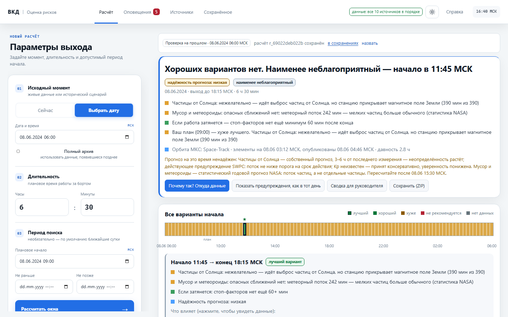

Что на экране:

- **Строка над ответом** — режим и момент («Проверка на прошлом · 08.06.2024 06:00 МСК»), номер расчёта, ссылки
  «в сохранениях» и «назвать».
- **Крупный заголовок** — ответ. Здесь честно: «Хороших вариантов нет. Наименее неблагоприятный — начало в 11:45 МСК»,
  потому что идёт протонное событие и во всех вариантах есть нежелательные условия.
- **Метки** — «надёжность прогноза: низкая» и статус варианта.
- **Строки по механизмам** с цветным маркером: частицы от Солнца, мусор и метеороиды, запас на задержку, сравнение с
  вашим планом (09:00 — хуже лучшего), источник и давность орбиты.
- **Оранжевый текст** — почему надёжность низкая и когда пересчитать («Пересчитайте после 08.06 15:30 МСК» — выпуск
  3-дневного прогноза SWPC).
- **Кнопки:** «Почему так? Откуда данные», «Показать предупреждения, как в тот день» (для «Сейчас» — «Следить и
  предупредить, если станет хуже»), «Сводка для руководителя», «Сохранить (ZIP)».

### 6.3. Полоса вариантов и карточка варианта

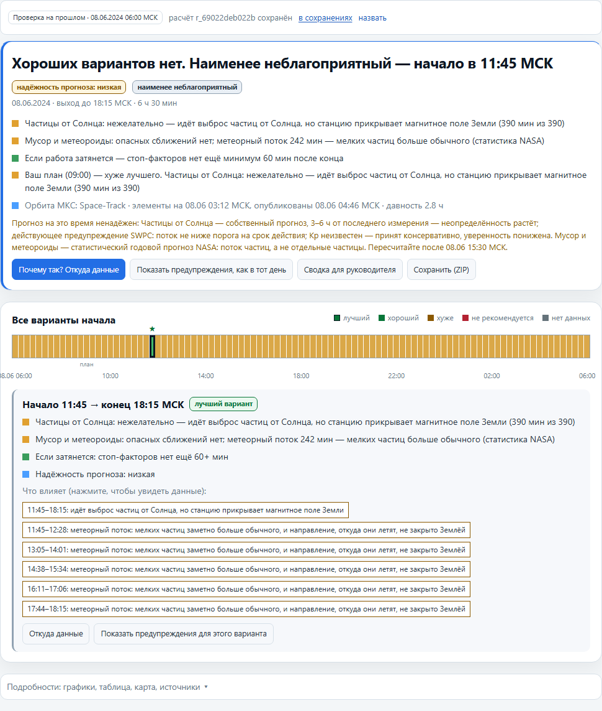

**«Все варианты начала»** — полоса из 97 квадратиков, по одному на каждый вариант начала с шагом 15 минут:

- тёмно-зелёный со звёздочкой ★ — лучший;
- зелёный — почти как лучший;
- оранжевый — хуже;
- красный — не рекомендуется (есть стоп-фактор);
- серый — нет данных.

Под полосой подписано время, отмечен «план». Клик по квадратику открывает **карточку варианта**: начало и конец,
строки по механизмам, запас на задержку, надёжность и список того, что влияет на вариант (каждый интервал кликабелен).
Кнопки карточки — «Откуда данные» и «Показать предупреждения для этого варианта».

### 6.4. «Почему так? Откуда данные»

Боковая панель доказательств. У каждой записи — метка типа (**ИЗМЕРЕНИЕ**, **СООБЩЕНИЕ SWPC**, **ВНЕШНИЙ ПРОГНОЗ**,
**НАШ РАСЧЁТ**, **ОРБИТА**, **КАТАЛОГ**), все значения с единицами и временем по Москве и кнопки «исходный файл #N» и
«откуда и когда скачан».

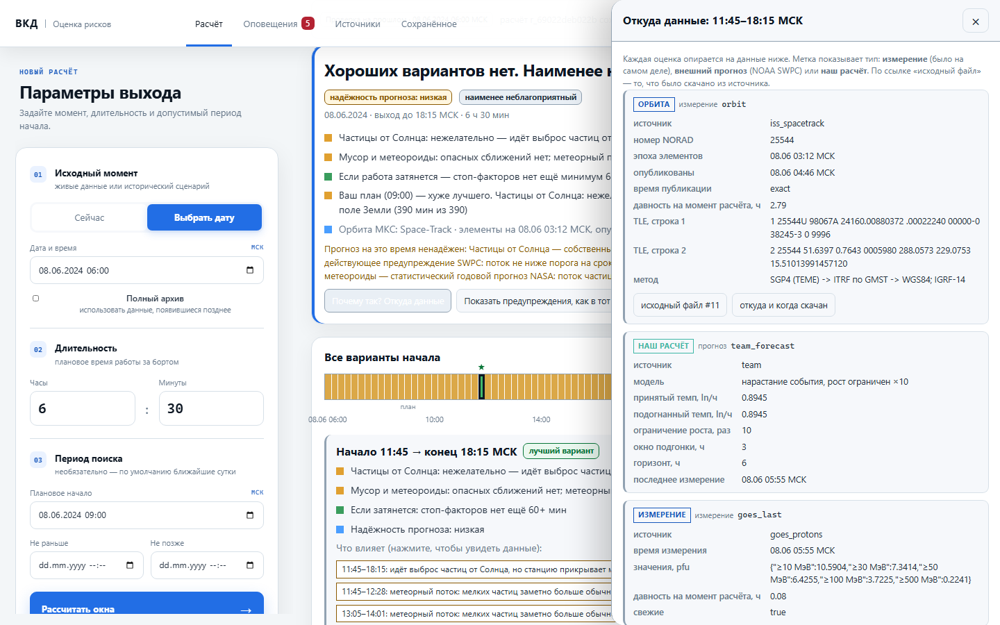

На скриншоте видно: орбита МКС (Space-Track, элементы опубликованы 08.06 04:46 МСК, т. е. до отсечки 06:00, TLE
целиком), наш прогноз (модель «нарастание события, рост ограничен ×10», подогнанный темп 0,89 ln/ч, горизонт 6 ч,
последнее измерение 05:55) и последнее измерение GOES (≥ 10 МэВ — 10,6 pfu).

Клик по интервалу в карточке варианта показывает итог для выхода и основания именно этого интервала:

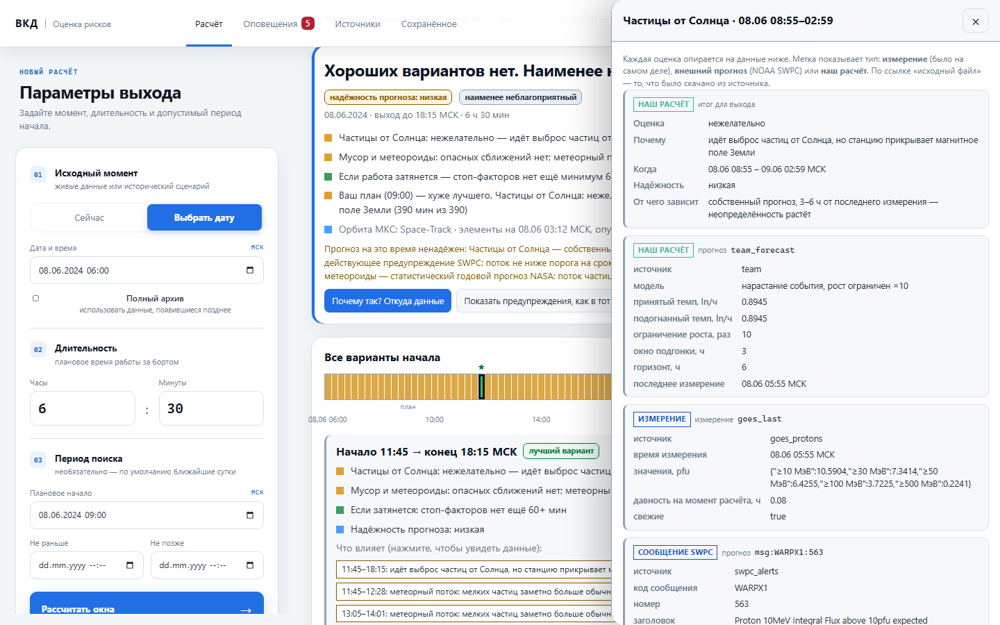

### 6.5. Подробности

Кнопка **«Подробности: графики, таблица, карта, источники»** раскрывает профессиональный вид.

**Полное объяснение** — рекомендация с номером правила, разбор лучшего и планового окна, причины низкой надёжности,
«когда пересчитать», ограничения оценки, версия алгоритма и хэши настроек:

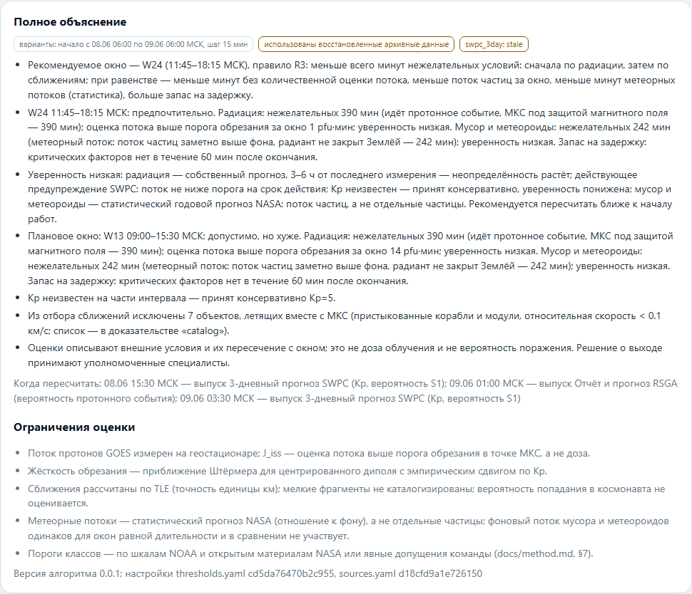

**«Как менялась обстановка»** — главный график. Сверху две полосы классов по механизмам, ниже — поток протонов GOES
≥ 10 и ≥ 100 МэВ, оценка того, что долетает до станции, индекс Kp и проходы ЮАА. Вертикальная линия **T** — момент
расчёта: слева сплошные линии (измерено), справа пунктир (прогноз), серая зона — дальше прогноза нет. Рамками отмечены
плановое и выбранное окна. Клик по полосе открывает доказательства.

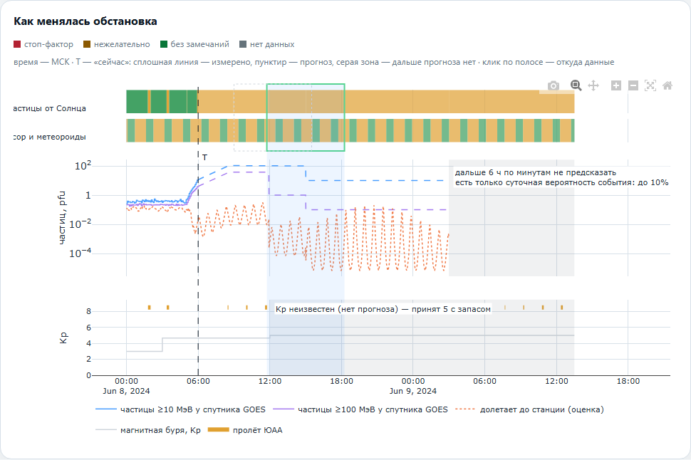

На графике 08.06.2024 видно, как поток растёт перед моментом T, как наш прогноз продолжает рост (не больше ×10) на
6 часов, как оценка потока в точке МКС «пульсирует» вместе с геомагнитной широтой станции на каждом витке и где Kp
неизвестен и принят равным 5 с запасом.

**«Таблица вариантов»** — все варианты с минутами «стоп / нежелательно / нет данных» по каждому механизму, потоком за
окно, запасом на задержку, надёжностью и номером. Здесь же можно изменить длительность и нажать «Пересчитать план»,
или скрыть не рекомендуемые варианты.

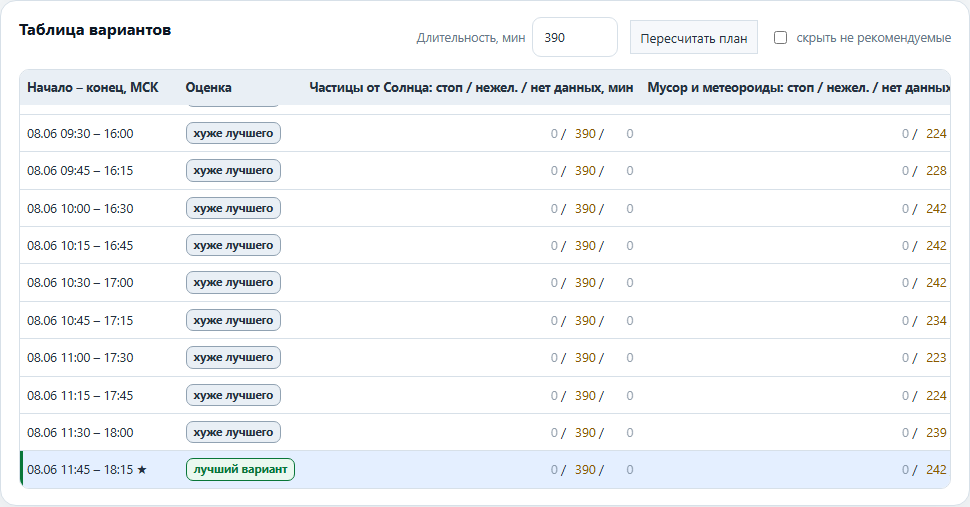

Ниже — четыре вкладки.

**«Где летит станция»** — трасса МКС за всё время поиска и точки выбранного окна, раскрашенные по обстановке в
каждый момент:

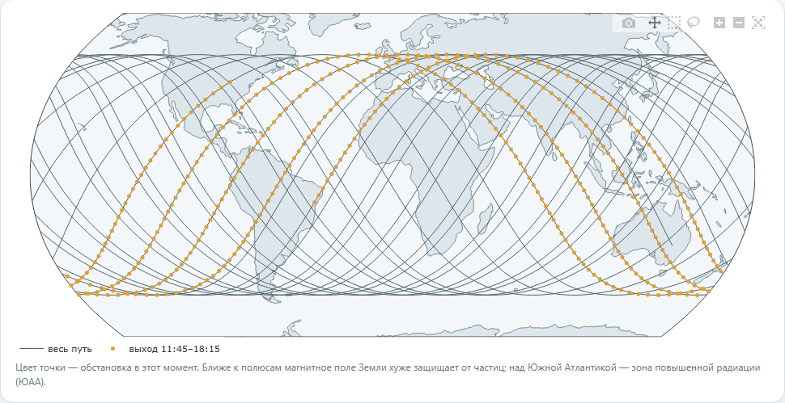

**«Данные и источники»** — на каких данных построен ответ: состояние каждого источника на момент расчёта, последние
данные, давность, сколько записей использовано, сколько **отброшено как вышедшие позже T** (например, 1890 измерений
GOES и 990 сообщений SWPC не попали в расчёт на 08.06 06:00), что восстановлено из архива, что отключено. Ниже —
орбита МКС с TLE.

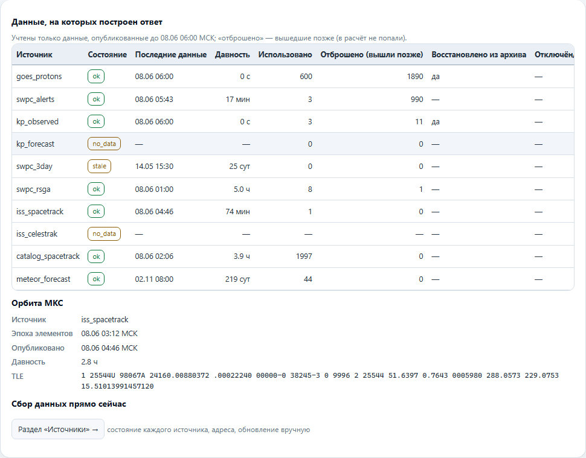

**«Что было на самом деле»** (только для прогноза из прошлого) — сервис считает то же самое по полному архиву и
сравнивает минуты после T: угадали, пропустили, ложная тревога, доли. Для 08.06.2024 рекомендованный вариант 11:45 на
деле оказался без стоп-факторов, все 1890 неблагоприятных минут по частицам предсказаны, ложных тревог нет.

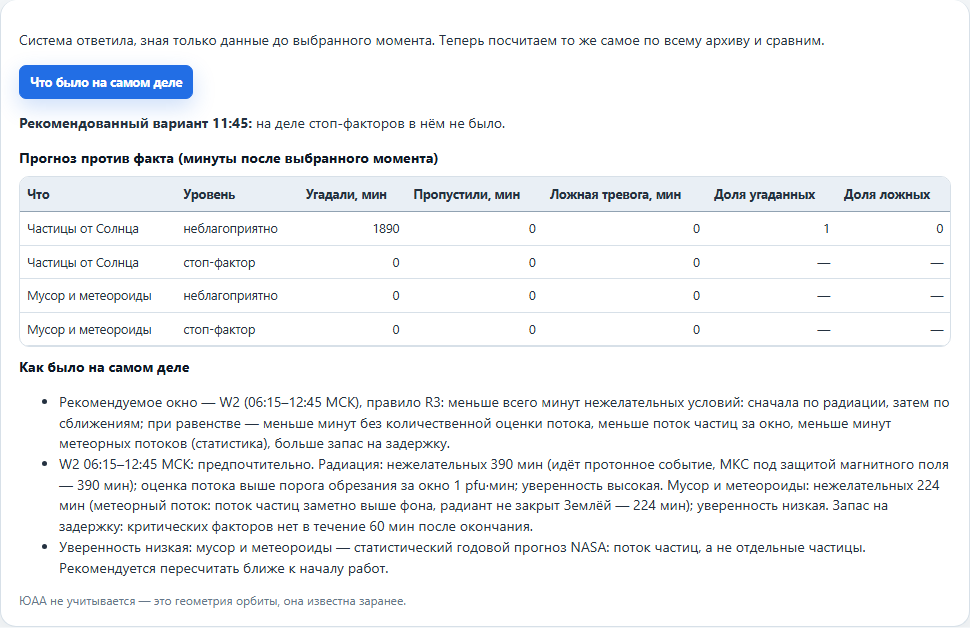

**«Сохранить»** — сводка для руководителя, полный отчёт, ZIP с отчётом и данными, JSON, строка статуса для экипажа или
табло, номер расчёта и версия алгоритма:

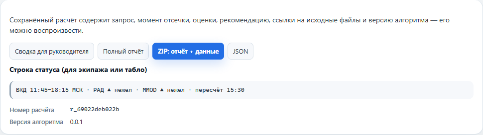

### 6.6. Документы для передачи

**Сводка для руководителя** — одна страница для печати: рекомендованное окно с надёжностью и пометкой
«предварительно», ключевые причины, когда пересчитать, лучшие окна и плановое, шкала по механизмам, строка статуса:

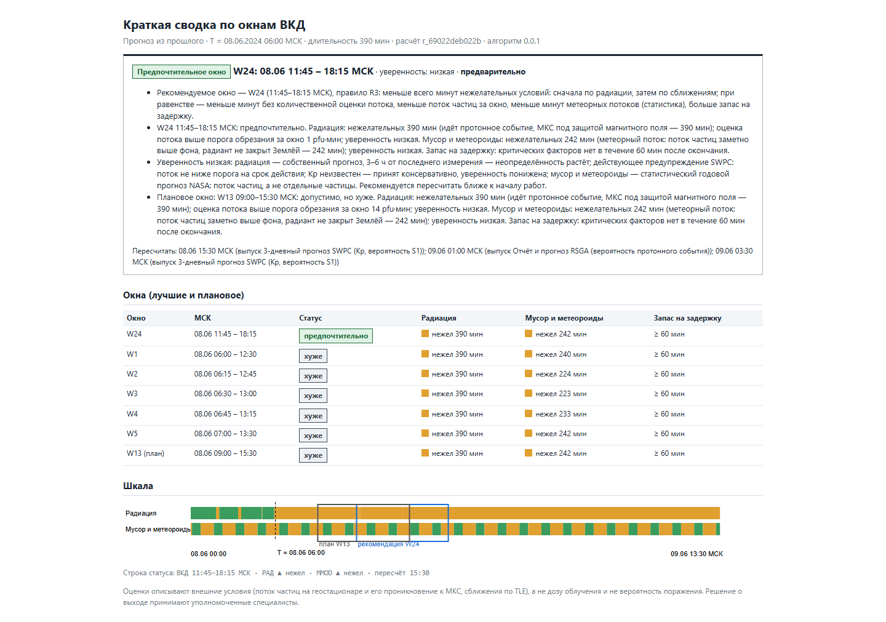

**Полный отчёт** — запрос, рекомендация с правилом, шкала классов, все окна, все неблагоприятные интервалы с
надёжностью и доказательствами, сближения ближе 50 км, источники со списком исходных файлов, орбита, доказательства,
ограничения. Начало отчёта:

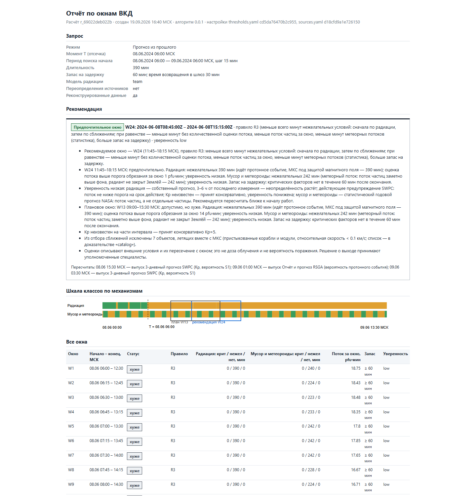

**ZIP-архив** содержит:

| Файл | Что внутри |
|---|---|
| `report.html` | полный отчёт |
| `brief.html` | краткая сводка |
| `run.json` | машиночитаемый результат: запрос, отсечка, оценки, рекомендация, доказательства, версия, хэши настроек |
| `manifest.json` | использованные исходные файлы |
| `series.csv` | временные ряды расчёта (поминутно) |
| `windows.csv` | все варианты |
| `intervals.csv` | интервалы с классами и причинами |
| `verification.json` | сверка с фактом (для прогноза из прошлого) |

**Строка статуса** — для экипажа или внешнего табло, не длиннее одной строки:

```
ВКД 11:45–18:15 МСК · РАД ▲ нежел · MMOD ▲ нежел · пересчёт 15:30
ВКД 19:45–23:45 МСК · РАД ● прием · MMOD ● прием · данные 11 мин · пересчёт 01:00
```

### 6.7. Пример: сближение с объектом

Сценарий «Сближение с объектом» — спокойный день 26.05.2024, плановое начало 03:45 МСК:

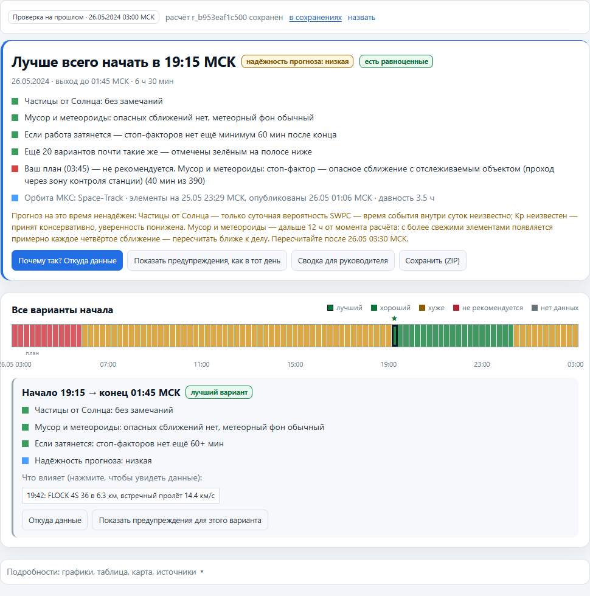

Ответ: «Лучше всего начать в 19:15 МСК», ещё 20 вариантов почти такие же. **Ваш план (03:45) — не рекомендуется:**
опасное сближение с отслеживаемым объектом, проход через зону контроля станции. На полосе видно красный блок в начале
суток — все варианты, в которые попадает это сближение.

Карточка планового варианта показывает, что именно мешает, — пролёты ЮАА и два интервала сближения со спутником
FLOCK 4S 4:

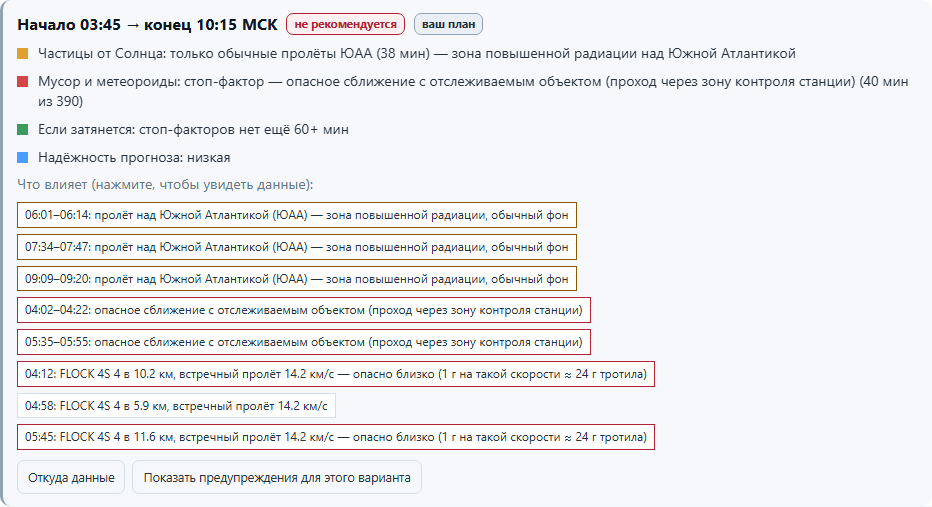

Доказательство сближения: объект NORAD 47491 (FLOCK 4S 4, спутник), момент наибольшего сближения 04:12 МСК,
расстояние 10,2 км, из них по высоте 0,48 км, вдоль орбиты −3,9 км, поперёк −9,5 км — внутри зоны контроля;
**встречный пролёт 14,2 км/с**, угол между скоростями 136°, энергия 1 г вещества **101 кДж ≈ 24 г тротила**; элементы
опубликованы 25.05 23:05 МСК (до отсечки), возраст 0,59 суток; надёжность средняя — сближение ближе 12 часов.

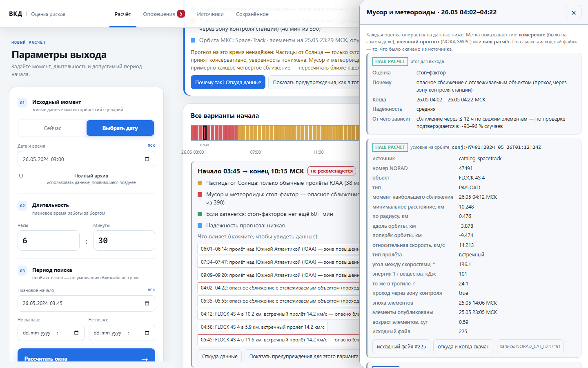

На карте сближения отмечены крестиками на трассе выхода:

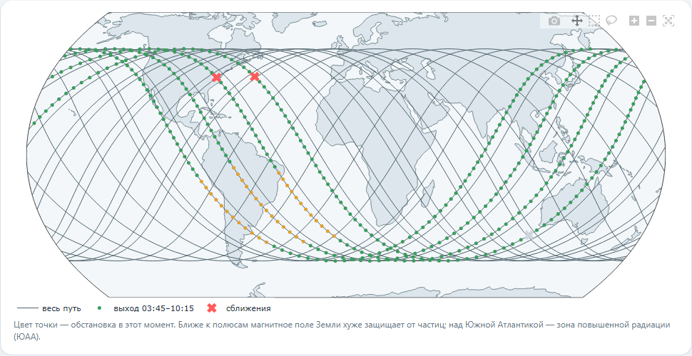

### 6.8. Пример: экстремальная обстановка

Сценарий «Экстремальная обстановка» — ночь на 11.05.2024: идёт протонное событие S2, и одновременно сильнейшая
магнитная буря G5 (Kp 8–9):

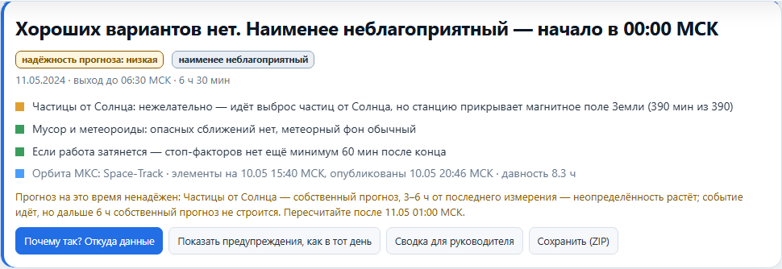

Сервис не выдаёт вариант за хороший: «Хороших вариантов нет. Наименее неблагоприятный — начало в 00:00 МСК»,
надёжность низкая, и указано, когда пересчитать. На графике видно, как высокий Kp держится весь период, а после T
прогноз потока доступен только на 6 часов — дальше лишь суточная вероятность события (до 55 %):

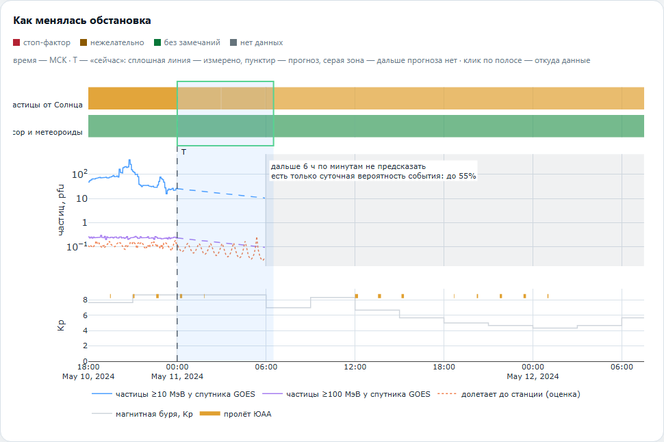

### 6.9. Проверка сбоя источника

В «Расширенных настройках» любой источник можно **отключить** или **заморозить на момент X** — только для своего
расчёта, не затрагивая других пользователей. Здесь же выбираются время возвращения в шлюз, запас на задержку, шаг
перебора и модель прогноза радиации:

<p align="center">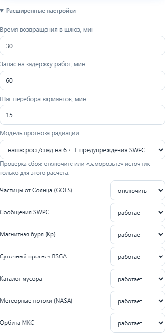</p>

Тот же спокойный день 26.05.2024 с отключённым источником протонов GOES:


Сервис отвечает **«Рекомендацию дать нельзя. Не хватает данных — это не значит, что всё хорошо»** и называет
проблемный источник. Это ключевое свойство: отсутствие данных никогда не превращается в «благоприятно».

### 6.10. Режим «Сейчас»

Расчёт по живым данным: выход 4 часа в ближайшие сутки от текущего момента.

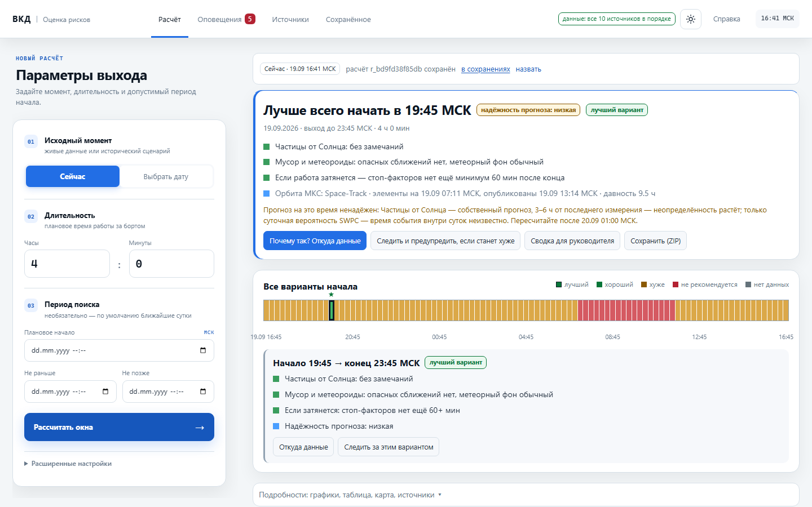

В этом режиме кнопка под ответом называется «Следить и предупредить, если станет хуже». В примере лучший вариант —
19:45 МСК, обе опасности без замечаний; красный блок на полосе — варианты, закрытые сближениями на следующее утро.

### 6.11. Оповещения

После «Следить…» (или «Показать предупреждения, как в тот день» для прошлой даты) открывается раздел **«Оповещения»**
с подтверждением: что слежение включено, как будут приходить сообщения, подключён ли Telegram.

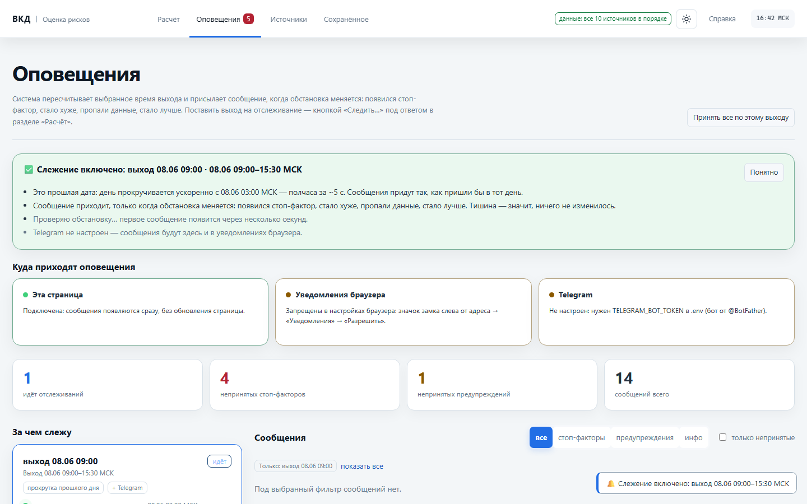

На странице:

- **«Куда приходят оповещения»** — три канала и их состояние: эта страница (подключена), уведомления браузера
  (разрешены или нет и как включить), Telegram (кто подключён, кнопка «Проверить связь»);
- **счётчики** — идёт отслеживаний, непринятых стоп-факторов, непринятых предупреждений, сообщений всего;
- **«За чем слежу»** — карточки слежений с живым индикатором последней проверки и текущим классом по механизмам;
- **«Сообщения»** — лента с фильтрами «все / стоп-факторы / предупреждения / инфо», «только непринятые», кнопками
  «Принято» и «Принять все».

Пример проигрывания 08.06.2024 для планового окна 09:00–15:30 МСК:

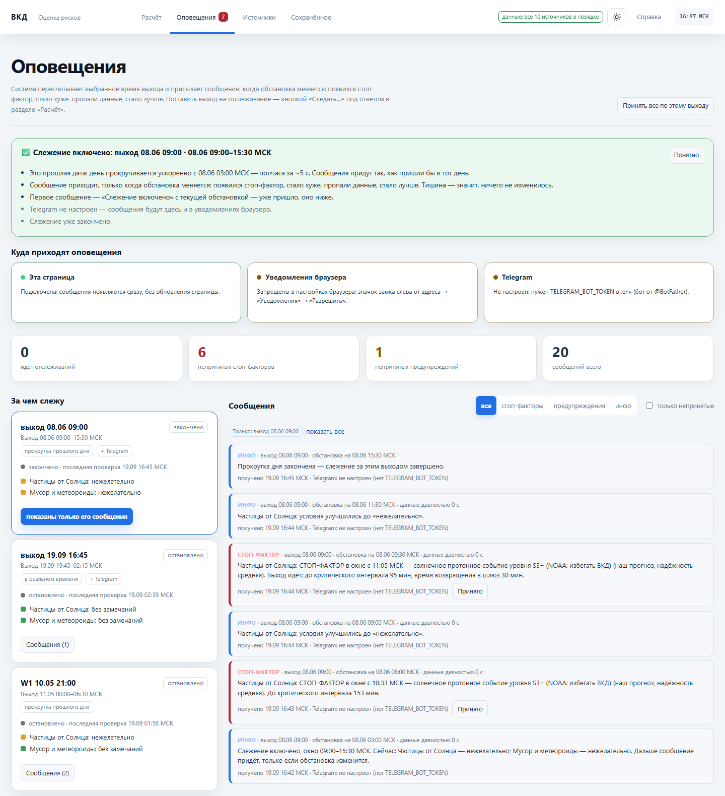

Читать снизу вверх:

1. «Часы» 03:00 МСК — «Слежение включено, окно 09:00–15:30 МСК. Сейчас: Частицы от Солнца — нежелательно…».
2. «Часы» 08:00 МСК — **«СТОП-ФАКТОР в окне с 10:33 МСК — солнечное протонное событие уровня S3+ (наш прогноз,
   надёжность средняя). До критического интервала 153 мин».** По официальным данным SWPC поток ≥ 10 МэВ достиг
   пика 1030 pfu (уровень S3) в 11:00 МСК — предупреждение пришло бы за 3 часа до этого и за час до начала выхода.
3. «Часы» 09:00 — улучшение до «нежелательно».
4. «Часы» 09:30 — снова стоп-фактор, теперь с учётом того, что выход уже идёт: **«до критического интервала 95 мин,
   время возвращения в шлюз 30 мин».**
5. «Часы» 11:30 — улучшение; 15:30 — «Прокрутка дня закончена».

### 6.12. Источники

Раздел **«Источники»** — всё, что сервис скачивает. Вверху счётчики (источников, в порядке, с замечаниями, обновляются
сейчас) и кнопка **«Обновить все»**. Источники сгруппированы по механизмам: «Частицы от Солнца и магнитная обстановка»,
«Орбита МКС», «Мусор и метеороиды».

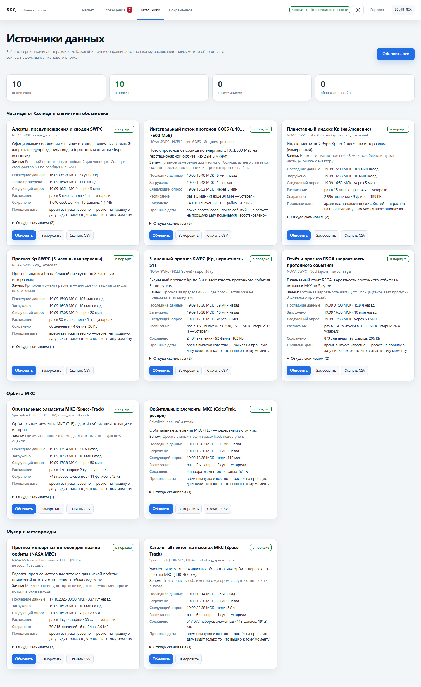

Карточка источника: что в нём и зачем он нужен, последние данные и их давность, когда загружено, следующий опрос,
расписание и порог устаревания, сколько сохранено, как источник ведёт себя в расчёте на прошлую дату, список адресов
(«Откуда скачиваем»), кнопки **«Обновить»**, **«Заморозить»**, **«Скачать CSV»**:

<p align="center">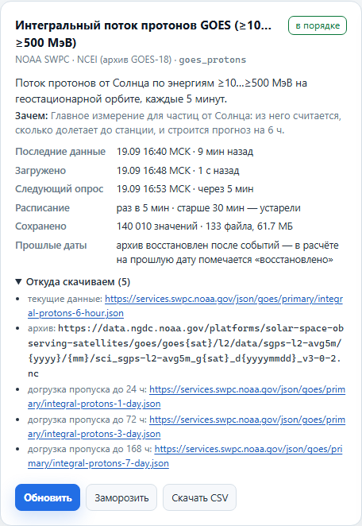</p>

Каталог Space-Track в CSV не выгружается — это требование условий использования Space-Track.

### 6.13. Сохранённое

Каждый расчёт сохраняется автоматически. Раздел **«Сохранённое»** — таблица с фильтром по режиму (все / сейчас /
прошлая дата / разбор), поиском по названию или дате, кратким ответом, надёжностью и отметкой о сверке с фактом.
Кнопки: «Открыть», «Сводка», «ZIP», «Назвать» / «Переименовать», «Удалить».

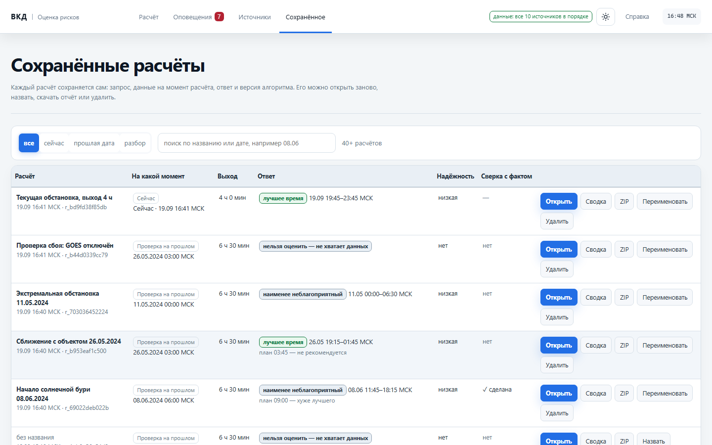

### 6.14. Тёмная тема

Переключатель в шапке меняет тему; выбор запоминается. По умолчанию тема следует настройке системы.

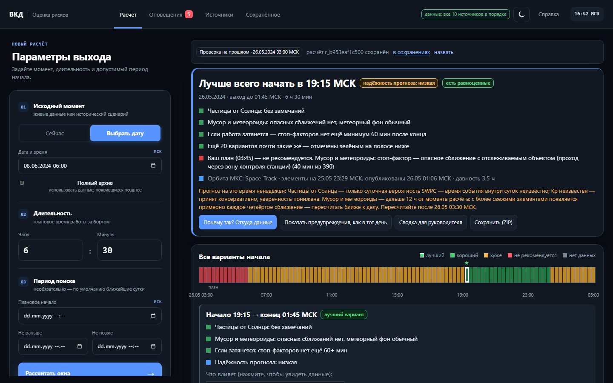

---

## 7. Графики работы и проверка качества

Проверка воспроизводится командами `python -m scripts.validate` (полнота архива, сценарии),
`python -m scripts.experiments` (≈3 мин) и `python -m scripts.experiments_mmod` (≈15 мин). Результаты лежат в
[examples/experiments/](examples/experiments/), подробный разбор — в [docs/experiments.md](docs/experiments.md).

### 7.1. Полнота архива за 01.05–30.06.2024

| Данные | Покрытие |
|---|---|
| Протоны GOES-18 (реконструкция L2) | 61 сутки × 288 пятиминуток — без пропусков |
| Kp (GFZ) | 61 сутки |
| 3-дневный прогноз SWPC | 57 выпусков; **нет выпусков 15.05–16.06** (пропуск в архиве NCEI, закрывается RSGA) |
| RSGA | 60 выпусков |
| Сообщения SWPC | 413 |
| Орбита МКС (Space-Track, с датой публикации) | 409 наборов элементов |
| Каталог на высотах МКС | 61 сутки, до ≈1970 объектов в сутки |
| Прогноз метеорных потоков NASA на 2024 г. | весь год, почасово, выпуск 02.11.2023 |

Отложенные периоды (08–24.02, 22–27.03, 08–13.10.2024) загружены теми же адаптерами полностью, кроме 3-дневного прогноза
за 08–24.02 (его нет в архиве NCEI; закрывается RSGA).

### 7.2. Восстановленный поток GOES против официальных сводок SWPC

| Событие | Начало по SWPC | Первое ≥ 10 pfu (наше) | Пик по SWPC | Пик (наш) |
|---|---|---|---|---|
| 10.05.2024 | 13:35 | 13:20 | 207 pfu, 17:45 | 404 pfu, 17:45 |
| 13.05.2024 | 14:00 | 14:00 | 121 pfu, 05:20 (14.05) | 124 pfu, 05:20 |
| 08.06.2024 | 02:55 | 02:55 | 1030 pfu, 08:00 | 996 pfu, 08:00 |

Время UTC. Время начала и пика совпадает во всех трёх событиях, величина — в двух. 10.05 наша реконструкция вдвое
выше: мы берём максимум двух апертур датчика, а в начале события поток неравномерен по направлениям. Это ошибка в
безопасную сторону.

### 7.3. Сценарии: что должно получиться и что получилось

| Сценарий | Ожидание | Результат |
|---|---|---|
| Прогноз из прошлого 08.06 06:00 МСК (нарастание) | событие идёт, данные только до T | все окна «нежелательно»; прогноз — рост ×10; данных после T не использовано |
| Прогноз из прошлого 08.06 12:00 МСК (пик S3) | без завышения S3 | до исправления прогноз держал S3 322 мин — исправлено правилом роста |
| Разбор 11.05 (буря G5 + S2) | открытые участки орбиты при Kp 8–9 | 18 мин стоп-факторов и 129 мин частичного проникновения; 32 окна из 97 не рекомендуются |
| Спокойный 26.05 | окна различаются ЮАА и сближениями | 21 равноценное лучшее окно; 2 сближения с проходом зоны контроля исключают 12 окон |
| GOES отключён или заморожен | «нет данных», а не «благоприятно» | итог «недостаточно оснований» |
| Каталог отключён | то же для сближений | то же |
| Режим «Сейчас» | живые данные | все источники в порядке, рекомендация с подсказкой пересчёта |

### 7.4. Эксперимент: прогноз из прошлого на солнечных событиях

**Как устроен.** На каждом событии через каждые 3 часа (на спокойных периодах — каждые 12 часов) делается прогноз из
прошлого: окно 6,5 ч, поиск на 24 ч, только данные до T. Затем тот же расчёт по полному архиву даёт «факт». Сравниваются
минуты после T (ЮАА исключена). Три модели:

- **наш прогноз** — свой прогноз на 6 ч + предупреждения SWPC + суточные вероятности;
- **«как сейчас, так и будет»** — поток сохраняется;
- **только предупреждения SWPC** — готовые предупреждения, иначе фон.

**Честность проверки.** На событиях мая–июня 2024 года шла отладка модели и подбор параметров, поэтому для независимой
проверки отложены события, которые при отладке не использовались: протонные события S2+ 09.02, 12.02, 23.03 и самое
сильное в октябре (S3, 09.10), плюс спокойный период 19–23.02. Параметры после этого не менялись.

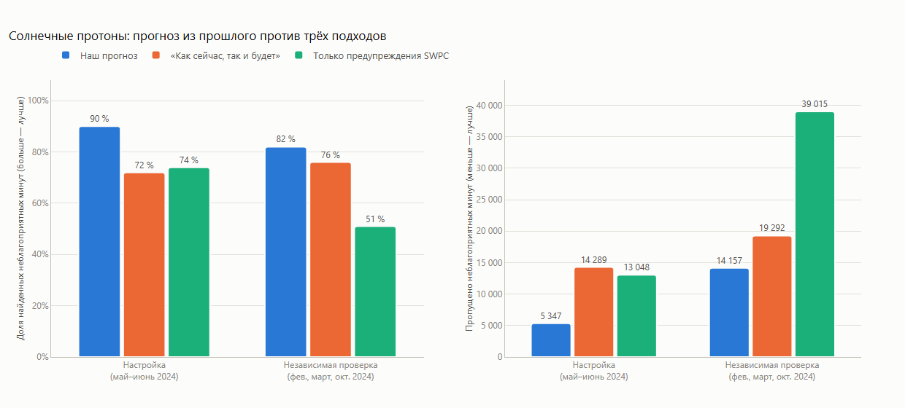

| Набор | Модель | Доля найденных неблагоприятных минут (POD) | Доля ложных тревог (FAR) | Пропущено, мин | Ложная тревога, мин |
|---|---|---|---|---|---|
| настройка (май–июнь) | **наш прогноз** | **0,90** | 0,05 | 5 347 | 2 546 |
| | «как сейчас, так и будет» | 0,72 | 0,06 | 14 289 | 2 278 |
| | только предупреждения SWPC | 0,74 | 0,09 | 13 048 | 3 636 |
| **независимая проверка** (фев., март, окт.) | **наш прогноз** | **0,82** | 0,02 | 14 157 | 1 465 |
| | «как сейчас, так и будет» | 0,76 | 0,02 | 19 292 | 1 093 |
| | только предупреждения SWPC | 0,51 | 0,03 | 39 015 | 1 093 |

Минуты суммированы по всем отсечкам.

**Выводы:**

- **Независимая проверка подтверждает выигрыш**, хотя и меньший, чем на данных настройки: 0,82 против 0,76 и 0,51
  при той же малой доле ложных тревог (0,02). Разрыв на настройке больше (0,90 против 0,72) — ожидаемая переоценка на
  данных, по которым подбирались параметры.
- **Главный выигрыш — на спаде и продлении события** (12–14.02: 1,00 против 0,76; 13–16.05: 0,98 против 0,70): наш
  поток не «обрывается» раньше официального окончания события.
- **Начало события не предсказывает ни одна модель** (09.02, 08.06): до вспышки есть только суточная вероятность.
- **Стоп-фактор при сочетании сильного события и бури G4–G5 — граница применимости.** 24.03 и 10.10 рекомендованное
  окно на деле попадало на критические интервалы в 7 и 10 случаях из 11; «как сейчас» ошибается так же или чаще.
  Поэтому в таких случаях консоль пишет «хороших вариантов нет — наименее неблагоприятный», надёжность низкая, указано,
  когда пересчитать, а в режиме «Сейчас» слежение пришлёт оповещение о появлении стоп-фактора.
- **Предупреждение без события** (12.06) даёт ложную тревогу всем моделям, которые учитывают предупреждения, — это
  безопасная сторона.
- **Спокойные периоды** (24–29.05 и отложенный 19–23.02): ни одной ложной тревоги по протонам.

### 7.5. Эксперимент: устойчивость прогноза сближений

Отсечки каждые 12 часов с 01.05 по 30.06.2024 (122 отсечки), поиск 24 ч. Прогноз — проходы зоны контроля по элементам,
опубликованным до T. «Факт» — тот же отбор по более поздним элементам. Совпадение — тот же объект и момент сближения в
пределах ±10 мин.

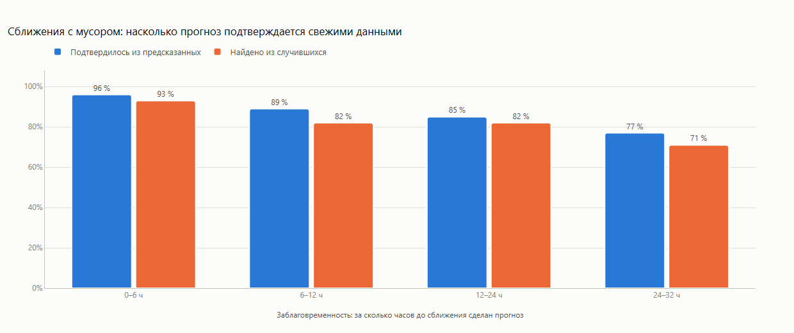

| За сколько до сближения | Предсказано | Подтвердилось | Ложных | Пропущено | Доля подтверждённых | Доля найденных |
|---|---|---|---|---|---|---|
| 0–6 ч | 51 | 49 | 2 | 4 | 0,96 | 0,93 |
| 6–12 ч | 47 | 42 | 5 | 9 | 0,89 | 0,82 |
| 12–24 ч | 100 | 85 | 15 | 19 | 0,85 | 0,82 |
| 24–32 ч | 57 | 44 | 13 | 18 | 0,77 | 0,71 |
| всего | 255 | 220 | 35 | 50 | 0,86 | 0,82 |

**Выводы:** прогноз сближений устойчив на горизонте до полусуток — 89–96 % предсказанных проходов подтверждаются;
на 24–32 ч — 77 %, и примерно каждое четвёртое сближение появляется только с новыми элементами. Поэтому надёжность
сближения — средняя до 12 ч и низкая дальше. По окнам: сближение закрывает 25 % окон в прогнозе и 28 % на деле;
рекомендованное окно на деле оказалось закрыто в 6 случаях из 122.

### 7.6. Ошибки, которые нашла проверка, и исправления

| Что нашли | Как проявлялось | Исправление |
|---|---|---|
| В разборе использовались орбитальные элементы «из будущего» | распространение назад на 2 года давало 16 ложных сближений | эпоха элементов — не позже середины участка |
| Старый прогноз Kp перекрывал свежее наблюдение бури | буря недооценивалась | берётся максимум из сохранения и прогноза |
| Модель спада «гасила» событие, не завершённое SWPC | поток обрывался раньше времени | нижняя граница S1 до сводки об окончании, спад не быстрее 0,15 ln/ч |
| Окна без количественной оценки выигрывали из-за «нулевого» потока | неизвестное выглядело хорошим | неизвестное ранжируется ниже |
| Прогноз держал S3 после пика | 322 мин ложного S3 | рост только если поток растёт и за 3 ч, и за последний час |
| Пристыкованные корабли и модули (Nauka, Cygnus NG-20, Dragon, Progress) считались сближениями | ложные проходы зоны каждый виток, «нет подходящего окна» 08.05, 11.05, 13.05, 30.06 | признак «летит вместе с МКС»: ложных сближений 875 → 0, настоящие 169 проходов не изменились, дней без окна — 0 |

### 7.7. Автотесты

45 автотестов (`python -m pytest -q`): разбор каждого формата источника на сохранённых образцах, срез «на момент T»,
физика (орбита, магнитное поле, обрезание), отбор сближений и исключение пристыкованных объектов, метеорные потоки,
правило выбора окон, задания расчёта, API, самозагрузка архива, хранилище, Telegram, разделы консоли.

---

## 8. API

Все сервисы описаны автоматически в Swagger: `http://<сервис>/docs`. Снаружи доступен только `report` (порт 8000);
он проксирует `assessment` по префиксу `/api/a/…` и `ingest` по префиксу `/api/i/…`.

### 8.1. report — консоль и документы (порт 8000)

| Метод и адрес | Что делает |
|---|---|
| `GET /` | веб-консоль |
| `GET /health` | состояние всех трёх сервисов: `{"report":"ok","assessment":"ok","ingest":"ok"}` |
| `GET /runs/{id}/brief` | краткая сводка для руководителя (HTML для печати) |
| `GET /runs/{id}/report` | полный отчёт (HTML) |
| `GET /runs/{id}/status-line` | строка статуса (текст) |
| `GET /runs/{id}/export.zip` | ZIP: отчёт, сводка, JSON, CSV, манифест, сверка |
| `GET /api/alerts/stream` | поток оповещений в реальном времени (Server-Sent Events) |
| `/api/a/*`, `/api/i/*` | прокси к `assessment` и `ingest` |

### 8.2. assessment — расчёты, сверка, слежение (порт 8002)

| Метод и адрес | Что делает |
|---|---|
| `POST /runs` | создать расчёт → `{"run_id": "r_…", "status": "queued"}` |
| `GET /runs/{id}` | статус, прогресс и полный результат; `?include=summary` — кратко |
| `GET /runs?limit=&offset=&mode=&kind=` | сохранённые расчёты с кратким итогом, новые первыми |
| `POST /runs/{id}/label` | назвать расчёт |
| `DELETE /runs/{id}` | удалить расчёт вместе с его сверками |
| `POST /runs/{id}/verify` | сверка прогноза из прошлого с фактом (новый связанный расчёт) |
| `POST /watches` | поставить окно на отслеживание (сейчас или проигрывание прошлого дня) |
| `GET /watches`, `GET /watches/{id}` | список слежений, одно слежение |
| `POST /watches/{id}/stop` | остановить слежение |
| `GET /alerts?watch_id=&severity=&unacked=&newest=` | оповещения |
| `POST /alerts/{id}/ack`, `POST /alerts/ack-all` | отметить «принято» |
| `GET /notify/status`, `POST /notify/test` | состояние Telegram, тестовое сообщение |
| `GET /config` | действующие пороги и версия алгоритма |
| `GET /sources` | состояние источников |
| `GET /health` | проверка работоспособности |

**Поля запроса `POST /runs`:**

| Поле | Значения | По умолчанию |
|---|---|---|
| `mode` | `now` — сейчас, `replay` — прогноз из прошлого, `review` — разбор по архиву | `now` |
| `as_of` | момент T (UTC) — обязателен для `replay` и `review` | — |
| `duration_min` | длительность выхода, 60–480 мин | 390 |
| `earliest_start`, `latest_start` | период поиска начала (UTC) | ближайшие 24 ч |
| `planned_start` | плановое начало для сравнения | — |
| `step_min` | шаг перебора, 5–60 мин | 15 |
| `eva.return_to_airlock_min`, `eva.overrun_margin_min` | время возвращения в шлюз, запас на задержку, мин | 30, 60 |
| `mechanisms` | `["radiation", "mmod"]` или один из них | оба |
| `source_overrides` | `{"goes_protons": {"state": "disabled"}}` или `{"state": "frozen", "at": "…"}` — только для этого расчёта | — |
| `radiation_model` | `team` (наш), `persistence` («как сейчас»), `swpc_only` | `team` |

**Главные части результата:** `recommendation` (статус, окно, правило, надёжность), `windows` (все варианты с минутами по
классам), `timeline` (интервалы по механизмам с причинами и ссылками на доказательства), `series` (поминутные ряды для
графиков), `events.mmod` (сближения), `evidence` (доказательства), `explanation`, `recheck_after` («когда пересчитать»),
`limitations`, `sources`, `manifest`, `orbit`, `config`, `algorithm_version`.

### 8.3. ingest — сбор данных (порт 8001)

| Метод и адрес | Что делает |
|---|---|
| `GET /sources?detail=1` | источники: статус, свежесть, расписание, следующий опрос, объём, адреса |
| `POST /sources/{name}/refresh` | обновить источник сейчас |
| `POST /sources/refresh-all` | обновить все |
| `POST /sources/{name}/pause`, `/resume` | заморозить / возобновить обновление (сама снимается через 2 ч) |
| `GET /bootstrap`, `POST /bootstrap` | ход загрузки архива / повторить загрузку |
| `GET /raw/{raw_id}?locator=…` | исходный файл или его фрагмент (Space-Track — только выдержка по объекту) |
| `GET /raw/{raw_id}/meta` | откуда и когда скачан файл |
| `GET /export/{table}.csv?quantity=&from=&to=` | выгрузка таблицы в CSV |
| `GET /health` | проверка работоспособности |

### 8.4. Примеры

Прогноз из прошлого на 08.06.2024 03:00 UTC, выход 6 ч 30 мин, плановое начало 06:00 UTC:

```bash
curl -X POST http://localhost:8002/runs -H "Content-Type: application/json" -d '{
  "mode": "replay", "as_of": "2024-06-08T03:00:00Z", "duration_min": 390,
  "planned_start": "2024-06-08T06:00:00Z",
  "eva": {"return_to_airlock_min": 30, "overrun_margin_min": 60}
}'
# -> {"run_id": "r_...", "status": "queued"}
curl "http://localhost:8002/runs/r_...?include=summary"     # статус, рекомендация, объяснение
curl "http://localhost:8002/runs/r_..."                     # полный результат
curl -X POST "http://localhost:8002/runs/r_.../verify"      # сверка с фактом
```

Текущая обстановка, окно 4 часа, источник протонов отключён для проверки поведения:

```bash
curl -X POST http://localhost:8002/runs -H "Content-Type: application/json" -d '{
  "mode": "now", "duration_min": 240,
  "source_overrides": {"goes_protons": {"state": "disabled"}}
}'
```

Проигрывание прошлого дня с оповещениями:

```bash
curl -X POST http://localhost:8002/watches -H "Content-Type: application/json" -d '{
  "mode": "replay", "window_start": "2024-06-08T06:00:00Z", "duration_min": 390,
  "as_of": "2024-06-08T00:00:00Z", "sim_step_min": 30, "channels": ["web", "telegram"], "label": "ВКД-1"
}'
```

Выгрузка потока протонов за сутки: `GET /export/records.csv?quantity=p_ge10&from=2024-06-08&to=2024-06-09`.

---

## 9. Установка и запуск

### 9.1. В Docker (сервер)

```bash
git clone https://github.com/Serfetto/nice-reshenie.git && cd nice-reshenie
cp .env.example .env        # заполнить SPACETRACK_USER, SPACETRACK_PASSWORD, POSTGRES_PASSWORD
docker compose up -d --build
```

Проверка: откройте `http://<сервер>:8000` или выполните `curl http://localhost:8000/health`.

При первом старте `ingest` сам загрузит архив (≈15–20 минут). В консоли в это время виден индикатор «архив: загружено
N из M дней»; расчёты на ещё не загруженные дни покажут «нет данных». Синхронная загрузка с отчётом в консоль:
`docker compose --profile setup run --rm backfill`.

Сырые файлы лежат в `./data/raw`, база — в томе `pgdata`.

### 9.2. Локально без Docker (SQLite)

```bash
python -m venv .venv && .venv/Scripts/pip install -r requirements.txt   # Linux/macOS: .venv/bin/pip
uvicorn services.ingest.api:app --port 8001          # сбор данных + догрузка архива при старте
uvicorn services.assessment.api:app --port 8002      # расчёты + слежение
uvicorn services.report.app:app --port 8000          # консоль: http://localhost:8000
python -m pytest -q                                  # автотесты
```

Без переменной `DATABASE_URL` используется файл `data/app.db` (SQLite).

### 9.3. Переменные окружения (`.env`)

| Переменная | Назначение |
|---|---|
| `SPACETRACK_USER`, `SPACETRACK_PASSWORD` | учётная запись Space-Track — орбита МКС и каталог объектов (обязательно) |
| `POSTGRES_USER`, `POSTGRES_PASSWORD`, `POSTGRES_DB` | база в Docker Compose |
| `REPORT_PORT`, `INGEST_PORT`, `ASSESSMENT_PORT` | порты на хосте (наружу — только `REPORT_PORT`) |
| `TELEGRAM_BOT_TOKEN` | токен бота от @BotFather — включает оповещения в Telegram (необязательно) |
| `TELEGRAM_CHAT_ID` | дополнительный получатель (id своего чата), обычно не нужен |
| `TELEGRAM_POLLING` | `0` — не принимать команды бота (если тот же токен уже опрашивает другой экземпляр) |
| `DATABASE_URL` | адрес базы; без неё — SQLite `data/app.db` |
| `DATA_DIR` | папка данных (по умолчанию `./data`) |
| `INGEST_SCHEDULER`, `INGEST_BOOTSTRAP` | `0` — выключить планировщик / загрузку архива при старте |
| `WATCHER` | `0` — выключить слежение в `assessment` |
| `WATCH_NOW_INTERVAL_S`, `WATCH_TICK_S` | период пересчёта в режиме «Сейчас» (120 с) и шаг «часов» проигрывания (5 с) |

### 9.4. Командная строка

```bash
python -m services.ingest.cli bootstrap        # догрузить недостающие дни архива
python -m services.ingest.cli live             # один проход по живым источникам
python -m services.ingest.cli backfill ...     # загрузка архива за период
python -m services.assessment.cli run --mode replay --as-of 2024-06-08T03:00 --duration 390 --verify
python -m scripts.validate                     # полнота архива и сценарии
python -m scripts.experiments --out examples/experiments   # эксперимент по протонам (~3 мин)
python -m scripts.experiments_mmod             # эксперимент по сближениям (~15 мин)
python -m scripts.examples                     # пересобрать примеры в examples/
```

### 9.5. Настройки

| Файл | Что задаёт |
|---|---|
| `config/sources.yaml` | адреса источников, расписание опроса, порог устаревания, время плановых выпусков, архивные периоды, описания для консоли |
| `config/thresholds.yaml` | шаг сетки, шаг окон, допуски равноценности, приоритет механизмов, все пороги радиации, зона контроля и параметры отбора сближений, порог метеорных потоков |

---

## 10. Структура репозитория

```
nice-reshenie/
  DOCUMENTATION.md          # этот документ
  README.md                 # запуск, примеры, ограничения
  Dockerfile, docker-compose.yml, .env.example, requirements.txt
  config/
    sources.yaml            # источники: адреса, расписание, давность, архивные периоды
    thresholds.yaml         # пороги и параметры расчёта
  common/                   # настройки, схема БД, время (МСК/UTC), свежесть источников
  services/
    ingest/                 # сбор данных
      adapters/             # swpc_alerts, goes_protons, kp, swpc_text (3-дневный, RSGA), orbital, meteors
      bootstrap.py          # самозагрузка архива и пропусков
      scheduler.py          # расписание опроса
      store.py, registry.py, http.py, api.py, cli.py
    assessment/             # оценка окон
      slice.py              # срез «на момент T»
      core/orbit.py         # SGP4, ITRF, IGRF, ЮАА, геомагнитная широта
      core/radiation.py     # механизм 1: три слоя, прогноз на 6 ч, предупреждения, вероятности
      core/mmod.py          # механизм 2: отбор сближений
      core/meteors.py       # метеорные потоки и экранирование Землёй
      core/timeline.py      # классы и интервалы
      core/windows.py       # варианты, правило R1–R7, запас на задержку
      core/explain.py       # объяснения
      runner.py, jobs.py    # расчёт и очередь заданий
      verify.py             # сверка с фактом
      watch.py              # слежение и оповещения
      telegram.py           # бот
      api.py, cli.py, schemas.py
    report/                 # веб-консоль и документы
      app.py                # страницы, прокси, SSE, отчёт, сводка, ZIP
      render.py             # шкала для отчётов, CSV, строка статуса
      templates/            # index (консоль), report, brief
      static/               # app.js, pages.js, style.css, vendor/ (Plotly, карта мира)
  scripts/                  # validate, experiments, experiments_mmod, examples
  tests/                    # 45 автотестов
  examples/                 # сохранённые расчёты (ZIP) и результаты экспериментов
  docs/
    ARCHITECTURE.md         # проектный документ
    method.md               # метод оценки и обоснование порогов
    sources.md              # выбор и ранжирование источников
    experiments.md          # проверка и эксперименты
    diagrams/               # исходники схем (Mermaid)
    img/                    # скриншоты, схемы, графики этого документа
```

---

## 11. Технологии и библиотеки

| Часть | Что используем | Роль |
|---|---|---|
| Язык | Python 3.12 (Docker), проверено и на 3.14 | весь бэкенд |
| API | FastAPI 0.141, uvicorn 0.53, pydantic 2.13 | три сервиса, проверка запросов |
| Орбита | sgp4 2.27 | распространение орбит МКС и объектов каталога (векторный режим) |
| Магнитное поле | ppigrf 2.1 | модель IGRF-14 |
| Данные | numpy 2.5, pandas 3.0, netCDF4 1.7 | расчёты на сетке, чтение архива GOES |
| Хранилище | PostgreSQL 16, SQLAlchemy 2.0, psycopg 3.3; SQLite локально | записи, расчёты, `LISTEN/NOTIFY` |
| Планировщик | APScheduler 3.11 | расписание опроса источников |
| Сеть | httpx 0.28 | загрузка данных, прокси консоли, Telegram Bot API |
| Документы | Jinja2 3.1 | отчёт и сводка |
| Интерфейс | HTML, CSS, JavaScript без сборки; Plotly.js 2.35 (вложен) | консоль, графики, карта |
| Настройки | PyYAML, python-dotenv | конфиги и секреты |
| Тесты | pytest 9.1 | 45 автотестов |
| Развёртывание | Docker Compose | четыре контейнера, автоперезапуск, проверки здоровья |

Облачные API и языковые модели в пути расчёта не используются: сервис работает на собственном сервере, внешняя сеть
нужна только для сбора данных.

---

## 12. Ограничения и развитие

**Ограничения (они же выводятся в каждом отчёте):**

- Поток протонов GOES измерен на геостационаре; J_iss — оценка потока в точке МКС, а **не доза**.
- Жёсткость обрезания — приближение Штёрмера для центрированного диполя с эмпирическим сдвигом по Kp.
- Сближения рассчитаны по TLE (точность — единицы километров). Мелкие фрагменты не каталогизированы. Вероятность
  попадания в космонавта не оценивается. Проход зоны контроля по TLE — сигнал «проверить по уточнённым данным», а не
  готовое решение об уклонении.
- Метеорные потоки — статистический прогноз NASA, а не отдельные частицы.
- Начало протонного события до вспышки не предсказывается: есть только суточная вероятность.
- Сочетание сильного протонного события с бурей G4–G5 — граница применимости (раздел 7.4).
- Решение о выходе принимают уполномоченные специалисты.

**Развитие:**

- вспышки DONKI как предвестник протонов (08.06.2024: вспышка M9.7 за 1,5 ч до начала события);
- солнечный ветер ACE/DSCOVR для оценки Kp на ближайший час;
- этапы ВКД (выход из шлюза, переход, работы, возвращение) и сценарии «продолжать / сократить / перенести»;
- электроны внешнего радиационного пояса для высоких широт;
- уточнённые сообщения о сближениях вместо TLE.

---

## 13. Приложения

### А. Готовые примеры в репозитории

Каждый ZIP в [examples/](examples/) — та же выгрузка, что кнопка «Сохранить (ZIP)».

| Файл | Что показывает | Рекомендация | Сверка с фактом |
|---|---|---|---|
| `replay_20240608_0300.zip` | прогноз из прошлого 08.06.2024 03:00 UTC — протонное событие только началось | 08:45–15:15 UTC, надёжность низкая | стоп-факторов в рекомендованном окне не было |
| `review_20240511.zip` | разбор 11.05.2024 по полному архиву — буря G5 и событие S2 | лучшие окна равноценны — 13:30–20:00 UTC | — |
| `replay_20240526_conjunction.zip` | спокойный день: плановое окно закрыто сближением (встречный пролёт 14 км/с) | 16:15–22:45 UTC | стоп-факторов не было |
| `replay_20240526_goes_disabled.zip` | тот же день с отключённым источником протонов | «недостаточно оснований» | — |
| `replay_20241009_heldout.zip` | отложенное событие 09.10.2024 (S3 + буря G4) | 17:15–23:45 UTC, надёжность низкая | на деле в окне был стоп-фактор |
| `now.zip` | текущая обстановка на момент генерации примеров | лучшие окна равноценны | — |

### Б. Исходники схем

Схемы этого документа нарисованы в Mermaid; исходники — в [docs/diagrams/](docs/diagrams/), их можно править и
открывать в любом редакторе с поддержкой Mermaid (GitHub показывает их прямо в браузере).

| Схема | Файл |
|---|---|
| Общая схема сервиса | `01_architecture.mmd` |
| Сбор данных | `02_ingest.mmd` |
| Этапы расчёта | `03_pipeline.mmd` |
| Три слоя оценки радиации | `04_radiation.mmd` |
| Прогноз после момента T | `05_forecast.mmd` |
| Отбор сближений | `06_mmod.mmd` |
| Правило выбора варианта | `07_rules.mmd` |
| Срез данных на момент T | `08_replay.mmd` |
| Слежение и оповещения | `09_watch.mmd` |
| Путь аналитика | `10_journey.mmd` |

### В. Дополнительные документы

- [README.md](README.md) — краткий запуск и примеры;
- [docs/ARCHITECTURE.md](docs/ARCHITECTURE.md) — проектный документ (описывает замысел шире реализованного);
- [docs/method.md](docs/method.md) — метод оценки и основания порогов;
- [docs/sources.md](docs/sources.md) — источники данных, выбор и ранжирование;
- [docs/experiments.md](docs/experiments.md) — проверка данных и эксперименты по случаям.
